# SQL Tutor 2.0 — Complete Platform Transformation Specification

**Document version:** 1.0  
**Date:** June 9, 2026  
**Status:** Architecture & Product Specification  
**Audience:** Engineering, Product, Design, Leadership

---

## Document Control

| Field | Value |
|-------|-------|
| Current codebase | React 18 + Vite 5 SPA, 11 files, ~1,000 LOC |
| Target platform | Next.js + NestJS SaaS learning platform |
| Core principle | **Platform must function perfectly without AI** |
| Reference audit | [status.md](./status.md) |

---

## Table of Contents

1. [Product Vision](#1-product-vision)
2. [User Types](#2-user-types)
3. [User Stories](#3-user-stories)
4. [Functional Requirements](#4-functional-requirements)
5. [Non-Functional Requirements](#5-non-functional-requirements)
6. [Information Architecture](#6-information-architecture)
7. [Complete Frontend Specification](#7-complete-frontend-specification)
8. [Complete Backend Specification](#8-complete-backend-specification)
9. [Database Schema](#9-database-schema)
10. [Authentication Design](#10-authentication-design)
11. [AI Architecture](#11-ai-architecture)
12. [Monetization Design](#12-monetization-design)
13. [Analytics System](#13-analytics-system)
14. [Challenge System](#14-challenge-system)
15. [Gamification System](#15-gamification-system)
16. [Admin Platform](#16-admin-platform)
17. [Deployment Architecture](#17-deployment-architecture)
18. [Security Requirements](#18-security-requirements)
19. [Scalability Requirements](#19-scalability-requirements)
20. [Development Roadmap](#20-development-roadmap)

---

## Current Project Analysis & Migration Map

### What Exists Today (Preserve)

| Asset | Location | Migration Strategy |
|-------|----------|-------------------|
| Browser SQL execution | `useDatabase.js` + sql.js CDN | Keep client-side sql.js for SQLite challenges; add dialect adapters |
| Challenge content model | `challenges.js` | Migrate to DB-backed challenges; import existing 15 as seed data |
| Track structure | `TRACKS` in `challenges.js` | Evolve to Learning Paths (Beginner → Expert) |
| Schema explorer | `SchemaPanel.jsx` | Rebuild as Monaco-integrated schema browser |
| Progress tracking | `localStorage` in `App.jsx` | Migrate to server-side Progress Service |
| Result table | `ResultTable.jsx` | Rebuild in SQL Workspace with execution stats |
| Hints & validation messages | Per-challenge in `challenges.js` | Move to Challenge Service with multi-layer validation |

### What Must Be Replaced

| Current | Replacement | Reason |
|---------|-------------|--------|
| Vite + React SPA | Next.js 14 App Router | SSR, routing, API routes, SEO for marketing |
| Inline styles | Tailwind + shadcn/ui | Maintainability, responsiveness, design system |
| Textarea editor | Monaco Editor | Syntax highlighting, IntelliSense, formatting |
| Row-only `check()` functions | AST + result + structural validators | Anti-gaming, educational integrity |
| Direct Anthropic fetch | Optional AI Service with provider abstraction | Security, multi-provider, BYOK |
| No backend | NestJS API + PostgreSQL | Accounts, billing, analytics, admin |
| No routing | File-based + dynamic routes | Shareable challenge URLs |
| localStorage only | PostgreSQL + Redis cache | Cross-device sync, enterprise reporting |

### Legacy Challenge Inventory (Seed Migration)

| Track (v1) | Count | Maps to v2 Difficulty |
|------------|-------|----------------------|
| Beginner | 6 | Beginner |
| Analyst | 6 | Intermediate |
| Advanced | 3 | Advanced |

Existing dataset (`employees`, `departments`, `salaries`) becomes **Dataset ID: `corp-hr-v1`** in the admin platform.

---

## 1. Product Vision

### 1.1 Mission

SQL Tutor 2.0 is a **production-grade SQL learning platform** that teaches query writing through hands-on challenges, structured learning paths, and optional AI assistance — without requiring AI for any core learning outcome.

### 1.2 Positioning

Combine the best of:

| Platform | What We Adopt |
|----------|---------------|
| **SQLBolt** | Bite-sized challenges, immediate feedback, schema context |
| **DataCamp** | Learning paths, skill progression, certificates |
| **LeetCode SQL** | Difficulty tiers, validation rigor, leaderboard |
| **Codecademy** | Guided instruction, hints, workspace UX |

**Differentiator:** Fully functional free tier with browser-based SQL execution; AI is a premium enhancement, not a dependency.

### 1.3 Product Principles

1. **AI-optional core** — Every learning outcome achievable without AI
2. **Browser-first execution** — Zero backend latency for query runs (SQLite); server execution for PostgreSQL/MySQL dialect challenges
3. **Honest validation** — Structural + result validation prevents gaming
4. **Progressive disclosure** — Guests try free; accounts unlock persistence; premium unlocks AI + advanced content
5. **Admin no-code** — Content team creates challenges without deploys
6. **Provider-agnostic AI** — Claude, OpenAI, Gemini via abstraction; BYOK supported

### 1.4 Success Metrics (Year 1)

| Metric | Target |
|--------|--------|
| Monthly active learners | 50,000 |
| Challenge completion rate | > 60% |
| Free → registered conversion | > 25% |
| Registered → paid conversion | > 5% |
| Certificate issuance | 10,000 |
| Platform uptime | 99.9% |
| Core flow without AI | 100% functional |

### 1.5 High-Level System Diagram

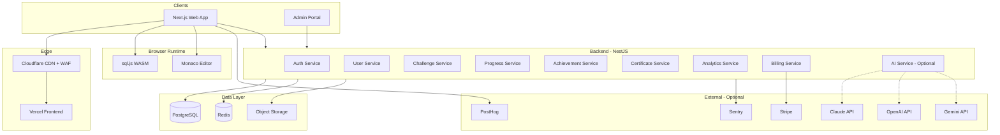

---

## 2. User Types

### 2.1 Guest (Unauthenticated)

| Capability | Allowed |
|------------|---------|
| Browse marketing site | Yes |
| Try SQL Workspace (sandbox) | Yes — session only |
| Complete guest challenges (max 3) | Yes |
| View public leaderboard (top 10) | Yes |
| View sample certificates | Yes |
| Save progress | No |
| Earn XP / achievements | No |
| Earn certificates | No |
| Access AI features | No |

**Session storage:** Temporary attempt data in `sessionStorage`; cleared on tab close.

### 2.2 Free User (Registered)

| Capability | Allowed |
|------------|---------|
| All Guest capabilities | Yes |
| Save progress (cloud sync) | Yes |
| Earn XP, levels, streaks | Yes |
| Unlock achievements | Yes |
| Complete all free-track challenges | Yes |
| Access community datasets | Yes |
| Daily challenges | Yes |
| Basic certificates (free tracks) | Yes |
| AI tutor / debugger / coach | No |
| Expert-tier challenges | No |
| Premium certificates | No |
| Team features | No |

### 2.3 Premium User (Pro Subscriber)

Everything in Free, plus:

| Capability | Allowed |
|------------|---------|
| Platform-hosted AI tutor | Yes — quota-based |
| AI query review | Yes |
| AI debugging assistant | Yes |
| AI learning coach | Yes |
| Advanced + Expert challenges | Yes |
| Premium certificates | Yes |
| Priority support | Yes |
| Ad-free experience | Yes |

**AI quota:** 100 requests/day default; configurable per plan.

### 2.4 BYOK User (Bring Your Own Key)

| Capability | Allowed |
|------------|---------|
| Connect Claude / OpenAI / Gemini keys | Yes |
| Use personal API credits | Yes |
| Choose preferred provider + model | Yes |
| Automatic failover between configured providers | Yes |
| Platform AI quota | Not consumed when BYOK active |
| Requires | Free or Premium account |

BYOK users on Free tier get AI features using their own keys. BYOK users on Premium get both platform quota AND BYOK.

### 2.5 Team User (Team Plan Member)

| Capability | Allowed |
|------------|---------|
| All Premium capabilities | Yes |
| Team progress dashboard | Yes |
| Assigned learning paths | Yes |
| Team leaderboard | Yes |
| Shared workspace snippets | Yes |
| Admin-assigned challenges | Yes |

### 2.6 Enterprise User

| Capability | Allowed |
|------------|---------|
| All Team capabilities | Yes |
| SSO / SAML | Yes |
| Custom branding | Yes |
| Custom datasets | Yes |
| LMS integration (SCORM/xAPI) | Yes |
| Dedicated support | Yes |
| Audit logs export | Yes |
| SLA | Yes |

### 2.7 Admin Roles

| Role | Permissions |
|------|-------------|
| **Super Admin** | Full platform access |
| **Content Admin** | Challenges, datasets, paths, achievements |
| **Support Admin** | User management, read-only analytics |
| **Analytics Viewer** | Dashboards only |
| **AI Admin** | Provider config, prompts, quotas (no user PII) |

### 2.8 Role Hierarchy

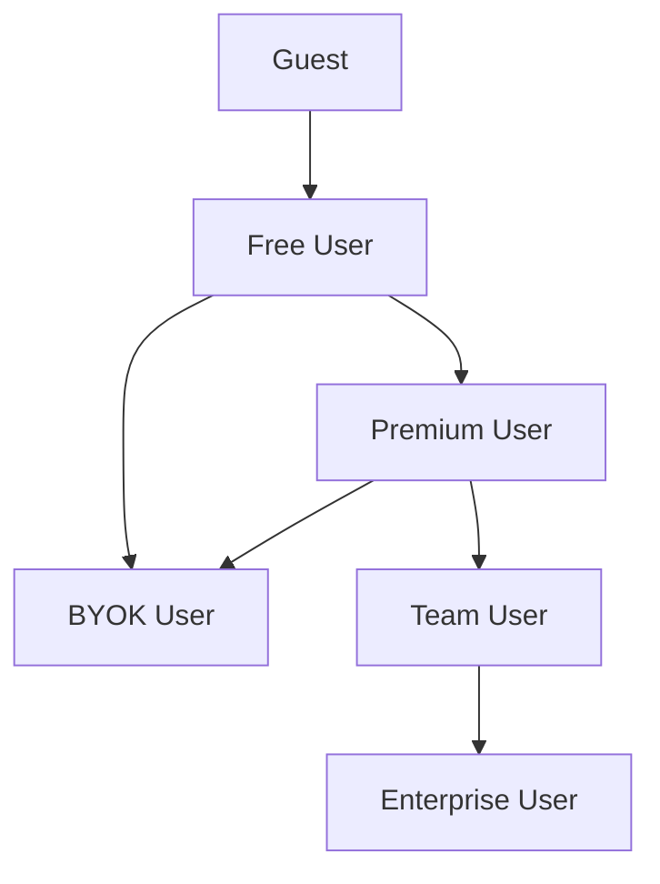

---

## 3. User Stories

### 3.1 Guest Stories

| ID | Story | Acceptance Criteria |
|----|-------|---------------------|
| G-01 | As a guest, I want to try SQL without signing up, so I can evaluate the platform | Sandbox workspace loads in < 3s; 3 sample challenges available |
| G-02 | As a guest, I want to see the leaderboard, so I feel motivated to join | Top 10 displayed; CTA to register |
| G-03 | As a guest, I want a sign-up prompt after completing a challenge, so I can save progress | Modal appears on 1st completion with benefits list |

### 3.2 Free User Stories

| ID | Story | Acceptance Criteria |
|----|-------|---------------------|
| F-01 | As a free user, I want my progress saved across devices | Login restores last position + completions |
| F-02 | As a free user, I want to earn XP for solving challenges | XP awarded on first pass only; visible on dashboard |
| F-03 | As a free user, I want hints without AI | Progressive hints (3 levels) available per challenge |
| F-04 | As a free user, I want to see my skill tree progress | Visual tree updates on concept mastery |
| F-05 | As a free user, I want a daily challenge | New challenge rotates at 00:00 UTC |

### 3.3 Premium User Stories

| ID | Story | Acceptance Criteria |
|----|-------|---------------------|
| P-01 | As a premium user, I want AI to explain SQL concepts | Tutor responds in < 5s; works without BYOK |
| P-02 | As a premium user, I want AI to debug my failed query | Debugger receives SQL + error + schema context |
| P-03 | As a premium user, I want AI to review my solution quality | Reviewer scores readability, efficiency, best practices |
| P-04 | As a premium user, I want a personalized learning plan | Coach generates plan from weak concepts |

### 3.4 BYOK User Stories

| ID | Story | Acceptance Criteria |
|----|-------|---------------------|
| B-01 | As a BYOK user, I want to store my API key securely | Key encrypted at rest; never returned in API responses |
| B-02 | As a BYOK user, I want to switch providers | Settings allow provider + model selection |
| B-03 | As a BYOK user, I want automatic failover | If primary fails, secondary provider attempted |

### 3.5 Admin Stories

| ID | Story | Acceptance Criteria |
|----|-------|---------------------|
| A-01 | As a content admin, I want to create challenges without code | Challenge Builder saves to DB; live in < 5 min |
| A-02 | As a content admin, I want to upload datasets | CSV/SQL upload → validated → published |
| A-03 | As an analytics viewer, I want drop-off reports | Funnel shows per-challenge abandonment |

### 3.6 Enterprise Stories

| ID | Story | Acceptance Criteria |
|----|-------|---------------------|
| E-01 | As an enterprise admin, I want SSO login | SAML 2.0 / OIDC supported |
| E-02 | As an enterprise admin, I want team progress reports | Export CSV/PDF; filter by department |

---

## 4. Functional Requirements

### 4.1 Core Platform (No AI Required)

| ID | Requirement | Priority |
|----|-------------|----------|
| FR-001 | Users can execute SQL in browser (SQLite via sql.js) | P0 |
| FR-002 | Users can complete challenges with multi-layer validation | P0 |
| FR-003 | Users can view schema for current dataset | P0 |
| FR-004 | Users can receive progressive hints (min 2 levels) | P0 |
| FR-005 | Registered users can save and resume progress | P0 |
| FR-006 | Users can browse challenges by difficulty, concept, dialect | P0 |
| FR-007 | Users can earn XP on first-time challenge completion | P0 |
| FR-008 | Users can view learning path progression | P0 |
| FR-009 | Users can earn achievements based on rules | P1 |
| FR-010 | Users can maintain daily streaks | P1 |
| FR-011 | Users can take assessments and earn certificates | P1 |
| FR-012 | Users can verify certificates via public URL | P1 |
| FR-013 | Admins can CRUD challenges via UI | P0 |
| FR-014 | Admins can CRUD datasets via UI | P0 |
| FR-015 | Platform tracks analytics events | P0 |
| FR-016 | Database resets to seed state per challenge attempt | P0 |
| FR-017 | Monaco editor with SQL syntax highlighting | P0 |
| FR-018 | Query history per challenge session | P1 |
| FR-019 | Solution reveal after N failed attempts | P1 |
| FR-020 | Public leaderboard | P1 |

### 4.2 AI Layer (Optional)

| ID | Requirement | Priority |
|----|-------------|----------|
| FR-AI-001 | AI Tutor explains concepts on demand | P1 |
| FR-AI-002 | AI Debugger analyzes failed queries | P1 |
| FR-AI-003 | AI Reviewer scores solution quality | P2 |
| FR-AI-004 | AI Coach generates learning plans | P2 |
| FR-AI-005 | Platform functions when AI disabled | P0 |
| FR-AI-006 | BYOK key storage and routing | P1 |
| FR-AI-007 | Provider abstraction (Claude/OpenAI/Gemini) | P1 |
| FR-AI-008 | AI usage metering and quotas | P1 |

### 4.3 Billing

| ID | Requirement | Priority |
|----|-------------|----------|
| FR-BILL-001 | Stripe subscription management | P1 |
| FR-BILL-002 | Free / Pro / Team / Enterprise tiers | P1 |
| FR-BILL-003 | Feature gating by plan | P0 |
| FR-BILL-004 | Invoice history | P2 |
| FR-BILL-005 | Team seat management | P2 |

---

## 5. Non-Functional Requirements

### 5.1 Performance

| ID | Requirement | Target |
|----|-------------|--------|
| NFR-001 | SQL query execution (browser) | < 500ms for seed datasets |
| NFR-002 | Challenge page load (LCP) | < 2.5s |
| NFR-003 | API response (p95) | < 300ms |
| NFR-004 | Monaco editor init | < 1s |
| NFR-005 | AI response (when enabled) | < 8s p95 |

### 5.2 Availability

| ID | Requirement | Target |
|----|-------------|--------|
| NFR-006 | Platform uptime | 99.9% |
| NFR-007 | Core learning (no AI) during AI outage | 100% available |
| NFR-008 | RPO / RTO | 1h / 4h |

### 5.3 Security

| ID | Requirement | Target |
|----|-------------|--------|
| NFR-009 | OWASP Top 10 compliance | Required |
| NFR-010 | BYOK keys encrypted at rest | AES-256-GCM |
| NFR-011 | All traffic TLS 1.2+ | Required |
| NFR-012 | Rate limiting on all public APIs | Required |

### 5.4 Accessibility

| ID | Requirement | Target |
|----|-------------|--------|
| NFR-013 | WCAG 2.1 AA | Required for app shell |
| NFR-014 | Keyboard navigation for challenge flow | Required |
| NFR-015 | Screen reader announcements for validation | Required |

### 5.5 Scalability

| ID | Requirement | Target |
|----|-------------|--------|
| NFR-016 | Concurrent users | 10,000 |
| NFR-017 | Registered users | 1M |
| NFR-018 | Challenges in catalog | 10,000 |

### 5.6 Maintainability

| ID | Requirement | Target |
|----|-------------|--------|
| NFR-019 | TypeScript strict mode | 100% typed |
| NFR-020 | Test coverage (services) | > 80% |
| NFR-021 | Test coverage (validation engine) | 100% |

---

## 6. Information Architecture

### 6.1 Site Map

```
sqltutor.com (Marketing - Next.js)
├── /                          Home
├── /features                  Features
├── /pricing                   Pricing
├── /about                     About
├── /blog                      Blog index
├── /blog/[slug]               Blog post
├── /contact                   Contact
├── /certificates/verify/[id]  Public certificate verification
└── /login, /signup            Auth entry

app.sqltutor.com (Application)
├── /dashboard                 Learner home
├── /paths                     Learning paths index
├── /paths/[slug]              Path detail
├── /challenges                Challenge explorer
├── /challenges/[slug]         Challenge player
├── /workspace                 Free SQL sandbox
├── /progress                  Progress center
├── /achievements              Achievement center
├── /certificates              My certificates
├── /certificates/[id]         Certificate detail
├── /leaderboard               Public leaderboard
├── /daily                     Daily challenge
├── /profile/[username]        Public profile
├── /settings                  Account settings
├── /settings/ai               AI & BYOK settings
├── /settings/billing          Billing (premium+)
└── /onboarding                First-run tutorial

admin.sqltutor.com (Admin)
├── /                          Admin dashboard
├── /challenges                Challenge list
├── /challenges/new            Challenge builder
├── /challenges/[id]/edit      Challenge editor
├── /datasets                  Dataset list
├── /datasets/new              Dataset builder
├── /paths                     Path manager
├── /achievements              Achievement manager
├── /users                     User management
├── /analytics                 Analytics dashboard
├── /ai                        AI management
└── /settings                  Platform settings
```

### 6.2 Navigation Model

| Zone | Primary Nav | Secondary Nav |
|------|-------------|---------------|
| Marketing | Home, Features, Pricing, Blog | Login, Sign Up |
| App (authenticated) | Dashboard, Paths, Challenges, Workspace | Progress, Achievements, Profile |
| App (user menu) | — | Settings, Billing, Logout |
| Admin | Dashboard, Content, Users, Analytics | AI Config, Settings |

### 6.3 Content Hierarchy

```
Platform
└── Learning Path (e.g., "SQL Fundamentals")
    └── Module (e.g., "Filtering Data")
        └── Challenge (e.g., "Filter with WHERE")
            └── Dataset (e.g., "corp-hr-v1")
                └── Tables, seed SQL, schema metadata
```

### 6.4 URL Design Principles

- Human-readable slugs: `/challenges/filter-with-where`
- Stable IDs internally; slugs for SEO
- Deep-linkable challenge state: `/challenges/filter-with-where?attempt=abc123`
- Certificate verification: `/certificates/verify/sqltutor-abc123xyz`

---

## 7. Complete Frontend Specification

### 7.1 Technology Stack

| Layer | Choice |
|-------|--------|
| Framework | Next.js 14 (App Router) |
| Language | TypeScript 5.x (strict) |
| Styling | Tailwind CSS 3.x |
| Components | shadcn/ui + Radix primitives |
| State (client) | Zustand + TanStack Query |
| Forms | React Hook Form + Zod |
| Editor | Monaco Editor (`@monaco-editor/react`) |
| SQL runtime | sql.js (npm, bundled WASM) |
| Charts | Recharts |
| Analytics (client) | PostHog |
| Error tracking | Sentry |

### 7.2 Global Layout Patterns

| Pattern | Desktop | Mobile |
|---------|---------|--------|
| App shell | Sidebar (240px) + main content | Bottom tab bar + hamburger |
| Max content width | 1280px | 100% with 16px padding |
| Challenge player | Split: instructions left, workspace right | Stacked: instructions → editor → results |
| Modals | Centered dialog (shadcn Dialog) | Full-screen sheet |

### 7.3 Standard Page States (All App Pages)

Every application page implements:

| State | Behavior |
|-------|----------|
| **Loading** | Skeleton matching layout; no layout shift |
| **Empty** | Illustration + primary CTA + explanation |
| **Error** | Retry button + support link; error boundary fallback |
| **Unauthorized** | Redirect to login with `?redirect=` param |
| **Forbidden** | Upgrade CTA for premium-gated content |

---

### 7.4 Marketing Site Pages

#### 7.4.1 Home (`/`)

| Attribute | Detail |
|-----------|--------|
| **Purpose** | Convert visitors; communicate value proposition |
| **Components** | `HeroSection`, `FeatureGrid`, `ChallengePreview`, `PricingTeaser`, `TestimonialCarousel`, `CTABanner`, `Footer` |
| **Layout** | Full-width sections; hero with embedded SQL demo iframe |
| **Desktop** | 2-column hero; 3-column feature grid |
| **Mobile** | Single column; sticky "Start Free" bottom bar |
| **Loading** | Static shell; demo iframe skeleton |
| **Empty** | N/A |
| **Error** | Demo iframe fallback image + "Try Workspace" CTA |

#### 7.4.2 Features (`/features`)

| Attribute | Detail |
|-----------|--------|
| **Purpose** | Deep-dive on platform capabilities |
| **Components** | `FeatureHero`, `ComparisonTable`, `WorkspaceScreenshot`, `AIFeatureSection` (marked "Optional"), `FAQ` |
| **Layout** | Alternating image/text sections |
| **Desktop** | Side-by-side feature blocks |
| **Mobile** | Stacked cards |
| **Loading** | Section skeletons |
| **Empty** | N/A |
| **Error** | Static fallback content |

#### 7.4.3 Pricing (`/pricing`)

| Attribute | Detail |
|-----------|--------|
| **Purpose** | Plan comparison and checkout initiation |
| **Components** | `PricingTable`, `FeatureMatrix`, `FAQ`, `EnterpriseCTA` |
| **Layout** | 4-column plan cards (Free, Pro, Team, Enterprise) |
| **Desktop** | Horizontal cards with highlighted "Pro" |
| **Mobile** | Vertical swipeable cards |
| **Loading** | Card skeletons |
| **Empty** | N/A |
| **Error** | "Pricing unavailable" + contact sales |

#### 7.4.4 About (`/about`)

| Attribute | Detail |
|-----------|--------|
| **Purpose** | Company story, mission, team |
| **Components** | `MissionStatement`, `TeamGrid`, `Timeline` |
| **Layout** | Single column narrative |
| **Desktop/Mobile** | Responsive grid for team |
| **Loading/Empty/Error** | Standard patterns |

#### 7.4.5 Blog (`/blog`, `/blog/[slug]`)

| Attribute | Detail |
|-----------|--------|
| **Purpose** | SEO content, SQL tutorials, product updates |
| **Components** | `BlogIndex`, `BlogCard`, `BlogPost`, `RelatedPosts`, `NewsletterSignup` |
| **Layout** | Index: card grid; Post: article with TOC sidebar |
| **Desktop** | 3-column index; post with 240px TOC |
| **Mobile** | Single column; collapsible TOC |
| **Loading** | Card/post skeletons |
| **Empty** | "No posts yet" |
| **Error** | 404 page for missing slug |

#### 7.4.6 Contact (`/contact`)

| Attribute | Detail |
|-----------|--------|
| **Purpose** | Support and sales inquiries |
| **Components** | `ContactForm`, `SupportLinks`, `EnterpriseCard` |
| **Layout** | Form + sidebar with FAQ links |
| **Desktop** | 2-column |
| **Mobile** | Stacked |
| **Loading** | Form skeleton |
| **Empty** | N/A |
| **Error** | Inline form validation + submit error toast |

---

### 7.5 Application Pages

#### 7.5.1 Dashboard (`/dashboard`)

| Attribute | Detail |
|-----------|--------|
| **Purpose** | Learner home; resume learning; show progress summary |
| **Components** | `WelcomeBanner`, `ContinueCard`, `StreakWidget`, `XPProgressBar`, `DailyChallengeCard`, `RecentAchievements`, `RecommendedPaths`, `WeakConcepts` |
| **Layout** | 12-column grid |
| **Desktop** | Continue (8col) + Streak/XP (4col); paths grid below |
| **Mobile** | Single column priority: Continue → Daily → Streak |
| **Loading** | Dashboard skeleton |
| **Empty** | New user: "Start your first challenge" CTA → onboarding |
| **Error** | Partial render with retry per widget |

#### 7.5.2 Learning Paths (`/paths`, `/paths/[slug]`)

| Attribute | Detail |
|-----------|--------|
| **Purpose** | Browse and enter structured curricula |
| **Components** | `PathCard`, `PathDetail`, `ModuleList`, `PathProgress`, `PrerequisiteBadge` |
| **Layout** | Index: card grid; Detail: hero + module accordion |
| **Desktop** | 3-column index; detail with sidebar progress |
| **Mobile** | Cards stack; sticky "Continue" button |
| **Loading** | Path card skeletons |
| **Empty** | "No paths match filters" |
| **Error** | Path not found → redirect to index |

#### 7.5.3 Challenge Explorer (`/challenges`)

| Attribute | Detail |
|-----------|--------|
| **Purpose** | Search, filter, browse all challenges |
| **Components** | `ChallengeFilters`, `ChallengeGrid`, `ChallengeCard`, `DifficultyBadge`, `ConceptTag` |
| **Layout** | Filter sidebar + grid |
| **Desktop** | 280px filter sidebar + 3-column grid |
| **Mobile** | Filter sheet (bottom drawer) + 1-column list |
| **Loading** | Grid skeleton |
| **Empty** | "No challenges match" + clear filters |
| **Error** | Retry fetch |

#### 7.5.4 Challenge Player (`/challenges/[slug]`)

| Attribute | Detail |
|-----------|--------|
| **Purpose** | Core learning experience — solve SQL challenges |
| **Components** | `ChallengeHeader`, `InstructionPanel`, `HintPanel`, `MonacoSQLWorkspace`, `ValidationFeedback`, `ResultViewer`, `SchemaBrowser`, `SolutionReveal`, `AIPanel` (gated, collapsible) |
| **Layout** | Split panel: 40% instructions / 60% workspace |
| **Desktop** | Resizable split pane (react-resizable-panels) |
| **Mobile** | Tabbed: Instructions \| Editor \| Results |
| **Loading** | Workspace skeleton; sql.js init spinner |
| **Empty** | N/A (always has challenge content) |
| **Error** | DB init fail: retry + report; validation engine fail: fallback message |

**Preserved from v1:** Challenge prompt, hints, run/reset flow, success/error feedback, schema context, auto-advance on solve.

**Replaced from v1:** Textarea → Monaco; inline styles → Tailwind; localStorage → API sync; row-only check → ValidationEngine.

#### 7.5.5 SQL Workspace (`/workspace`)

| Attribute | Detail |
|-----------|--------|
| **Purpose** | Free-form SQL practice sandbox (no challenge) |
| **Components** | `DatasetSelector`, `MonacoSQLWorkspace`, `ResultViewer`, `SchemaBrowser`, `QueryHistory`, `ExecutionStats`, `ExportResults` |
| **Layout** | Full-height IDE layout |
| **Desktop** | Left: schema tree; Center: editor; Bottom: results; Right: history |
| **Mobile** | Collapsible panels; editor full-screen toggle |
| **Loading** | sql.js init + dataset load |
| **Empty** | "Select a dataset to begin" |
| **Error** | Query error inline; DB error banner |

**Monaco SQL Workspace Specification:**

| Feature | Implementation |
|---------|----------------|
| Syntax highlighting | Monarch tokenizer for SQL |
| IntelliSense | Custom completion provider from dataset schema |
| Table suggestions | Triggered after `FROM`, `JOIN` |
| Column suggestions | Triggered after `SELECT`, `WHERE`, dot notation |
| SQL formatter | `sql-formatter` library, Cmd/Ctrl+Shift+F |
| Query history | Last 50 queries per session; persisted for registered users |
| Split panel | react-resizable-panels: editor 60% / results 40% |
| Result viewer | Paginated table, column sort, CSV export |
| Schema browser | Tree view: tables → columns → types → sample values |
| Execution stats | Rows returned, execution time (ms), query plan (when available) |

#### 7.5.6 Progress Center (`/progress`)

| Attribute | Detail |
|-----------|--------|
| **Purpose** | Detailed learning analytics for the user |
| **Components** | `OverallProgress`, `ConceptMasteryChart`, `PathProgressList`, `ActivityCalendar`, `TimeSpentChart` |
| **Layout** | Dashboard-style grid |
| **Desktop** | 2x2 chart grid + path list |
| **Mobile** | Scrollable sections |
| **Loading** | Chart skeletons |
| **Empty** | "Complete your first challenge" CTA |
| **Error** | Partial data with retry |

#### 7.5.7 Achievement Center (`/achievements`)

| Attribute | Detail |
|-----------|--------|
| **Purpose** | View earned and locked achievements |
| **Components** | `AchievementGrid`, `AchievementCard`, `ProgressRing`, `ShareButton` |
| **Layout** | Filterable grid (earned / locked / all) |
| **Desktop** | 4-column grid |
| **Mobile** | 2-column grid |
| **Loading** | Card skeletons |
| **Empty** | "Start learning to earn achievements" |
| **Error** | Retry |

#### 7.5.8 Certificates (`/certificates`, `/certificates/[id]`)

| Attribute | Detail |
|-----------|--------|
| **Purpose** | View earned certificates; share verification links |
| **Components** | `CertificateList`, `CertificateDetail`, `ShareModal`, `DownloadPDF` |
| **Layout** | List + detail view |
| **Desktop** | Certificate rendered at 800px width |
| **Mobile** | Full-width certificate; share via native share API |
| **Loading** | Certificate skeleton |
| **Empty** | "Complete a path assessment to earn certificates" |
| **Error** | Certificate not found |

#### 7.5.9 Leaderboard (`/leaderboard`)

| Attribute | Detail |
|-----------|--------|
| **Purpose** | Competitive motivation via XP rankings |
| **Components** | `LeaderboardTable`, `PeriodToggle` (weekly/all-time), `UserRankCard` |
| **Layout** | Table with top 100 |
| **Desktop** | Full table with avatar, name, XP, level |
| **Mobile** | Compact list; sticky user rank at bottom |
| **Loading** | Row skeletons |
| **Empty** | "Be the first on the leaderboard" |
| **Error** | Retry |

#### 7.5.10 Profile (`/profile/[username]`)

| Attribute | Detail |
|-----------|--------|
| **Purpose** | Public learner profile |
| **Components** | `ProfileHeader`, `StatsSummary`, `AchievementShowcase`, `CertificateBadges` |
| **Layout** | Header + tabbed content |
| **Desktop** | 3-column achievement showcase |
| **Mobile** | Stacked |
| **Loading** | Profile skeleton |
| **Empty** | Private profile message |
| **Error** | 404 |

#### 7.5.11 Settings (`/settings`, `/settings/ai`, `/settings/billing`)

| Attribute | Detail |
|-----------|--------|
| **Purpose** | Account, preferences, AI/BYOK, billing management |
| **Components** | `ProfileForm`, `PasswordChange`, `NotificationPrefs`, `AIProviderSettings`, `BYOKKeyManager`, `BillingPortal`, `PlanCard` |
| **Layout** | Settings sidebar + content panel |
| **Desktop** | 200px nav + content |
| **Mobile** | Settings as stacked sections |
| **Loading** | Form skeleton |
| **Empty** | N/A |
| **Error** | Inline field errors |

#### 7.5.12 Onboarding (`/onboarding`)

| Attribute | Detail |
|-----------|--------|
| **Purpose** | First-run tutorial for new registered users |
| **Components** | `OnboardingStepper`, `SkillAssessment` (optional), `GoalSelector`, `PathRecommendation` |
| **Layout** | Centered wizard (max 600px) |
| **Desktop/Mobile** | Same stepped flow; 4 steps |
| **Loading** | Step skeleton |
| **Empty** | N/A |
| **Error** | Skip option always available |

---

### 7.6 Admin Pages

#### 7.6.1 Admin Dashboard (`/`)

| Attribute | Detail |
|-----------|--------|
| **Purpose** | Platform health overview |
| **Components** | `KPICards`, `ActiveUsersChart`, `CompletionFunnel`, `RecentActivity`, `AlertsPanel` |
| **Layout** | 12-column analytics grid |
| **Desktop** | Full dashboard |
| **Mobile** | Read-only; simplified KPI cards |
| **Loading/Empty/Error** | Standard |

#### 7.6.2 Challenge Builder (`/challenges/new`, `/challenges/[id]/edit`)

| Attribute | Detail |
|-----------|--------|
| **Purpose** | No-code challenge creation |
| **Components** | `ChallengeForm`, `InstructionEditor`, `DatasetPicker`, `HintEditor`, `ValidationRuleBuilder`, `ExpectedResultPreview`, `SolutionEditor`, `XPConfig`, `PreviewPlayer` |
| **Layout** | Tabbed editor: Content \| Validation \| Settings \| Preview |
| **Desktop** | Full editor with live preview panel |
| **Mobile** | Read-only review; edit on desktop only (v1) |
| **Loading** | Form skeleton |
| **Empty** | New challenge defaults |
| **Error** | Validation errors per tab |

#### 7.6.3 Dataset Builder (`/datasets/new`)

| Attribute | Detail |
|-----------|--------|
| **Purpose** | Create and manage challenge datasets |
| **Components** | `SQLUploader`, `CSVImporter`, `TableEditor`, `SchemaPreview`, `SeedValidator` |
| **Layout** | Wizard: Upload → Preview → Validate → Publish |
| **Desktop** | Split: editor + live schema preview |
| **Mobile** | Upload only; edit on desktop |
| **Loading** | Upload progress |
| **Empty** | "Upload SQL or CSV" |
| **Error** | Validation errors with line numbers |

#### 7.6.4 User Management (`/users`)

| Attribute | Detail |
|-----------|--------|
| **Purpose** | Search, view, manage user accounts |
| **Components** | `UserTable`, `UserDetail`, `RoleEditor`, `BanToggle`, `ImpersonateButton` (super admin) |
| **Layout** | Table + slide-over detail |
| **Desktop** | Full table with filters |
| **Mobile** | Search + card list |
| **Loading/Empty/Error** | Standard |

#### 7.6.5 Analytics Dashboard (`/analytics`)

| Attribute | Detail |
|-----------|--------|
| **Purpose** | Platform-wide learning analytics |
| **Components** | `CompletionRateChart`, `DropoffFunnel`, `ChallengeHeatmap`, `HintUsageChart`, `AIUsageChart`, `CohortAnalysis` |
| **Layout** | Filterable dashboard |
| **Desktop** | Multi-panel |
| **Mobile** | Simplified KPI view |
| **Loading/Empty/Error** | Standard |

#### 7.6.6 AI Management (`/ai`)

| Attribute | Detail |
|-----------|--------|
| **Purpose** | Configure platform AI (not user BYOK) |
| **Components** | `ProviderConfig`, `PromptTemplates`, `QuotaSettings`, `UsageDashboard`, `ModelSelector` |
| **Layout** | Settings panels |
| **Desktop** | Full config |
| **Mobile** | Read-only |
| **Loading/Empty/Error** | Standard |

---

## 8. Complete Backend Specification

### 8.1 Technology Stack

| Layer | Choice |
|-------|--------|
| Framework | NestJS 10.x |
| Language | TypeScript 5.x (strict) |
| ORM | Prisma 5.x |
| Database | PostgreSQL 15 (Supabase) |
| Cache | Redis 7 (Upstash) |
| Queue | BullMQ (Redis-backed) |
| Auth | Passport.js + JWT + OAuth |
| File storage | Supabase Storage / S3 |
| API docs | OpenAPI 3.1 (Swagger) |
| Validation | class-validator + Zod (shared schemas) |

### 8.2 Domain Architecture

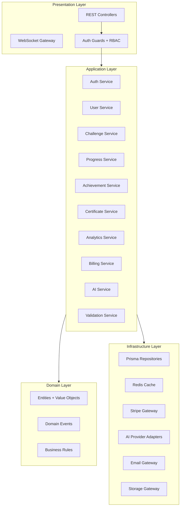

### 8.3 Module Structure

```
src/
├── main.ts
├── app.module.ts
├── common/
│   ├── guards/
│   ├── decorators/
│   ├── filters/
│   ├── interceptors/
│   └── pipes/
├── modules/
│   ├── auth/
│   ├── users/
│   ├── challenges/
│   ├── datasets/
│   ├── progress/
│   ├── achievements/
│   ├── certificates/
│   ├── analytics/
│   ├── billing/
│   ├── ai/
│   ├── validation/
│   ├── admin/
│   └── health/
└── prisma/
    └── schema.prisma
```

### 8.4 REST API Overview

**Base URL:** `https://api.sqltutor.com/v1`

#### Auth (`/auth`)

| Method | Endpoint | Description | Auth |
|--------|----------|-------------|------|
| POST | `/auth/register` | Create account | Public |
| POST | `/auth/login` | Email/password login | Public |
| POST | `/auth/logout` | Invalidate refresh token | User |
| POST | `/auth/refresh` | Refresh access token | Refresh token |
| POST | `/auth/forgot-password` | Send reset email | Public |
| POST | `/auth/reset-password` | Reset password | Token |
| GET | `/auth/oauth/:provider` | OAuth redirect | Public |
| GET | `/auth/oauth/:provider/callback` | OAuth callback | Public |

#### Users (`/users`)

| Method | Endpoint | Description | Auth |
|--------|----------|-------------|------|
| GET | `/users/me` | Current user profile | User |
| PATCH | `/users/me` | Update profile | User |
| GET | `/users/:username` | Public profile | Public |
| DELETE | `/users/me` | Delete account | User |

#### Challenges (`/challenges`)

| Method | Endpoint | Description | Auth |
|--------|----------|-------------|------|
| GET | `/challenges` | List with filters | Public |
| GET | `/challenges/:slug` | Challenge detail | Public |
| POST | `/challenges/:slug/attempts` | Submit attempt | User |
| GET | `/challenges/:slug/attempts` | Attempt history | User |
| POST | `/challenges/:slug/hint` | Reveal hint level | User |

#### Datasets (`/datasets`)

| Method | Endpoint | Description | Auth |
|--------|----------|-------------|------|
| GET | `/datasets` | List datasets | Public |
| GET | `/datasets/:slug` | Dataset detail + schema | Public |
| GET | `/datasets/:slug/seed` | Seed SQL for browser execution | Public |

#### Progress (`/progress`)

| Method | Endpoint | Description | Auth |
|--------|----------|-------------|------|
| GET | `/progress` | User progress summary | User |
| GET | `/progress/paths/:slug` | Path progress | User |
| POST | `/progress/resume` | Save resume position | User |
| GET | `/progress/resume` | Get resume position | User |

#### Achievements (`/achievements`)

| Method | Endpoint | Description | Auth |
|--------|----------|-------------|------|
| GET | `/achievements` | All achievements + user status | User |
| GET | `/achievements/earned` | Earned only | User |

#### Certificates (`/certificates`)

| Method | Endpoint | Description | Auth |
|--------|----------|-------------|------|
| GET | `/certificates` | User certificates | User |
| GET | `/certificates/:id` | Certificate detail | User |
| GET | `/certificates/verify/:code` | Public verification | Public |
| POST | `/certificates/exams/:slug/start` | Start exam | User |
| POST | `/certificates/exams/:slug/submit` | Submit exam | User |

#### Analytics (`/analytics`)

| Method | Endpoint | Description | Auth |
|--------|----------|-------------|------|
| POST | `/analytics/events` | Ingest client events | User/Guest |
| GET | `/analytics/dashboard` | User dashboard data | User |
| GET | `/admin/analytics/*` | Admin dashboards | Admin |

#### Billing (`/billing`)

| Method | Endpoint | Description | Auth |
|--------|----------|-------------|------|
| GET | `/billing/subscription` | Current subscription | User |
| POST | `/billing/checkout` | Create Stripe checkout | User |
| POST | `/billing/portal` | Stripe customer portal | User |
| POST | `/billing/webhook` | Stripe webhooks | Stripe signature |

#### AI (`/ai`) — Optional Layer

| Method | Endpoint | Description | Auth |
|--------|----------|-------------|------|
| POST | `/ai/tutor` | Concept explanation | Premium/BYOK |
| POST | `/ai/debugger` | Query debug | Premium/BYOK |
| POST | `/ai/reviewer` | Solution review | Premium/BYOK |
| POST | `/ai/coach` | Learning plan | Premium/BYOK |
| GET | `/ai/usage` | Usage quota | User |
| POST | `/ai/keys` | Store BYOK key | User |
| DELETE | `/ai/keys/:provider` | Remove BYOK key | User |
| GET | `/ai/providers` | Available providers/models | User |

#### Admin (`/admin`)

| Method | Endpoint | Description | Auth |
|--------|----------|-------------|------|
| CRUD | `/admin/challenges` | Challenge management | Content Admin |
| CRUD | `/admin/datasets` | Dataset management | Content Admin |
| CRUD | `/admin/paths` | Path management | Content Admin |
| CRUD | `/admin/achievements` | Achievement management | Content Admin |
| GET/PATCH | `/admin/users` | User management | Support Admin |
| GET/PATCH | `/admin/ai` | AI configuration | AI Admin |

### 8.5 Service Specifications

#### Auth Service

- JWT access tokens (15 min) + refresh tokens (7 days, rotated)
- bcrypt password hashing (cost 12)
- OAuth: Google, GitHub
- Enterprise: SAML 2.0 / OIDC (Phase 8)
- Rate limit: 5 login attempts / 15 min per IP

#### User Service

- Profile CRUD, avatar upload, username uniqueness
- Role assignment (user, admin roles)
- Account deletion with 30-day soft delete
- Privacy settings (public profile toggle)

#### Challenge Service

- Challenge CRUD with versioning (draft → published → archived)
- Slug generation, full-text search
- Challenge-dataset binding
- Attempt recording with SQL snapshot
- Hint level tracking per attempt

#### Progress Service

- Completion state per user per challenge
- Resume position (path, challenge, scroll)
- XP award on first completion (idempotent)
- Streak calculation (daily activity UTC)

#### Achievement Service

- Rule engine: evaluate on events (challenge_complete, streak_7, etc.)
- Badge award (idempotent)
- Notification trigger on unlock

#### Certificate Service

- Exam assembly from question bank
- Timed exams with auto-submit
- PDF generation (stored in S3)
- Public verification codes (UUID + checksum)

#### Analytics Service

- Event ingestion (batch, async via BullMQ)
- Aggregation jobs (hourly rollups)
- Funnel computation
- Admin dashboard queries

#### Billing Service

- Stripe Checkout for subscriptions
- Webhook handling (subscription.created, updated, deleted)
- Feature flag resolution by plan
- Team seat provisioning

#### AI Service (Optional)

- Provider router with failover
- BYOK decryption at request time (never logged)
- Platform key for Premium users
- Quota enforcement via Redis counters
- Prompt template rendering
- Response streaming via SSE

#### Validation Service

- Server-side validation engine (mirrors client)
- AST parsing via `node-sql-parser`
- Result comparison with tolerance rules
- Structural rule evaluation
- Returns: `{ passed, layers: { ast, result, structural, performance } }`

### 8.6 Domain Events

| Event | Triggered By | Consumers |
|-------|--------------|-----------|
| `challenge.completed` | Progress Service | Achievement, Analytics, XP |
| `challenge.attempted` | Challenge Service | Analytics |
| `achievement.unlocked` | Achievement Service | Notification, Analytics |
| `certificate.issued` | Certificate Service | Email, Analytics |
| `subscription.changed` | Billing Service | User Service, Feature flags |
| `ai.request.completed` | AI Service | Analytics, Usage metering |
| `user.registered` | Auth Service | Analytics, Onboarding email |

---

## 9. Database Schema

### 9.1 Entity Relationship Diagram

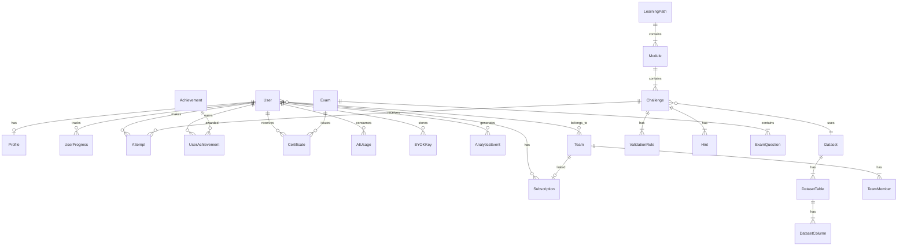

### 9.2 Prisma Schema (Core Tables)

```prisma
// ─── Users & Auth ───────────────────────────────────────────

model User {
  id            String    @id @default(cuid())
  email         String    @unique
  username      String    @unique
  passwordHash  String?
  role          UserRole  @default(USER)
  plan          Plan      @default(FREE)
  emailVerified DateTime?
  createdAt     DateTime  @default(now())
  updatedAt     DateTime  @updatedAt
  deletedAt     DateTime?

  profile       Profile?
  subscription  Subscription?
  progress      UserProgress[]
  attempts      Attempt[]
  achievements  UserAchievement[]
  certificates  Certificate[]
  aiUsage       AIUsage[]
  byokKeys      BYOKKey[]
  teamMembers   TeamMember[]
  analyticsEvents AnalyticsEvent[]
}

enum UserRole {
  USER
  CONTENT_ADMIN
  SUPPORT_ADMIN
  ANALYTICS_VIEWER
  AI_ADMIN
  SUPER_ADMIN
}

enum Plan {
  FREE
  PRO
  TEAM
  ENTERPRISE
}

model Profile {
  id          String   @id @default(cuid())
  userId      String   @unique
  user        User     @relation(fields: [userId], references: [id])
  displayName String?
  avatarUrl   String?
  bio         String?
  xp          Int      @default(0)
  level       Int      @default(1)
  streak      Int      @default(0)
  lastActive  DateTime?
  isPublic    Boolean  @default(true)
  preferences Json     @default("{}")
}

// ─── Content ────────────────────────────────────────────────

model LearningPath {
  id          String   @id @default(cuid())
  slug        String   @unique
  title       String
  description String
  difficulty  Difficulty
  isPremium   Boolean  @default(false)
  isPublished Boolean  @default(false)
  sortOrder   Int      @default(0)
  modules     Module[]
  createdAt   DateTime @default(now())
  updatedAt   DateTime @updatedAt
}

model Module {
  id        String       @id @default(cuid())
  pathId    String
  path      LearningPath @relation(fields: [pathId], references: [id])
  title     String
  sortOrder Int          @default(0)
  challenges Challenge[]
}

model Challenge {
  id           String     @id @default(cuid())
  slug         String     @unique
  title        String
  concept      String
  instructions String
  difficulty   Difficulty
  dialect      SQLDialect @default(SQLITE)
  xpReward     Int        @default(10)
  datasetId    String
  dataset      Dataset    @relation(fields: [datasetId], references: [id])
  moduleId     String?
  module       Module?    @relation(fields: [moduleId], references: [id])
  solution     String?
  isPremium    Boolean    @default(false)
  isPublished  Boolean    @default(false)
  hints        Hint[]
  validationRules ValidationRule[]
  attempts     Attempt[]
  createdAt    DateTime   @default(now())
  updatedAt    DateTime   @updatedAt
}

enum Difficulty {
  BEGINNER
  INTERMEDIATE
  ADVANCED
  EXPERT
}

enum SQLDialect {
  SQLITE
  POSTGRESQL
  MYSQL
  STANDARD
}

model Dataset {
  id          String         @id @default(cuid())
  slug        String         @unique
  name        String
  description String?
  seedSql     String
  isPublic    Boolean        @default(true)
  tables      DatasetTable[]
  challenges  Challenge[]
  createdAt   DateTime       @default(now())
  updatedAt   DateTime       @updatedAt
}

model DatasetTable {
  id        String          @id @default(cuid())
  datasetId String
  dataset   Dataset         @relation(fields: [datasetId], references: [id])
  name      String
  columns   DatasetColumn[]
}

model DatasetColumn {
  id       String       @id @default(cuid())
  tableId  String
  table    DatasetTable @relation(fields: [tableId], references: [id])
  name     String
  type     String
  note     String?
  isPrimaryKey Boolean @default(false)
}

model Hint {
  id          String    @id @default(cuid())
  challengeId String
  challenge   Challenge @relation(fields: [challengeId], references: [id])
  level       Int
  content     String
}

model ValidationRule {
  id          String         @id @default(cuid())
  challengeId String
  challenge   Challenge      @relation(fields: [challengeId], references: [id])
  type        ValidationType
  config      Json
  isRequired  Boolean        @default(true)
}

enum ValidationType {
  RESULT_SET
  ROW_COUNT
  COLUMN_NAMES
  COLUMN_VALUES
  SORT_ORDER
  AST_STRUCTURE
  TABLE_USAGE
  KEYWORD_REQUIRED
  PERFORMANCE
}

// ─── Progress & Attempts ────────────────────────────────────

model UserProgress {
  id          String    @id @default(cuid())
  userId      String
  user        User      @relation(fields: [userId], references: [id])
  challengeId String
  challenge   Challenge @relation(fields: [challengeId], references: [id])
  completed   Boolean   @default(false)
  completedAt DateTime?
  bestXp      Int       @default(0)
  hintsUsed   Int       @default(0)
  attempts    Int       @default(0)

  @@unique([userId, challengeId])
}

model Attempt {
  id          String    @id @default(cuid())
  userId      String
  user        User      @relation(fields: [userId], references: [id])
  challengeId String
  challenge   Challenge @relation(fields: [challengeId], references: [id])
  sql         String
  passed      Boolean
  validation  Json
  hintLevel   Int       @default(0)
  durationMs  Int?
  createdAt   DateTime  @default(now())
}

// ─── Gamification ───────────────────────────────────────────

model Achievement {
  id          String   @id @default(cuid())
  slug        String   @unique
  title       String
  description String
  icon        String
  rule        Json
  xpBonus     Int      @default(0)
  isSecret    Boolean  @default(false)
  users       UserAchievement[]
}

model UserAchievement {
  id            String      @id @default(cuid())
  userId        String
  user          User        @relation(fields: [userId], references: [id])
  achievementId String
  achievement   Achievement @relation(fields: [achievementId], references: [id])
  earnedAt      DateTime    @default(now())

  @@unique([userId, achievementId])
}

// ─── Certificates ───────────────────────────────────────────

model Exam {
  id           String         @id @default(cuid())
  slug         String         @unique
  title        String
  pathId       String?
  durationMin  Int
  passingScore Int
  isPremium    Boolean        @default(false)
  questions    ExamQuestion[]
  certificates Certificate[]
}

model ExamQuestion {
  id       String @id @default(cuid())
  examId   String
  exam     Exam   @relation(fields: [examId], references: [id])
  challengeId String?
  points   Int    @default(1)
  sortOrder Int   @default(0)
}

model Certificate {
  id           String   @id @default(cuid())
  userId       String
  user         User     @relation(fields: [userId], references: [id])
  examId       String
  exam         Exam     @relation(fields: [examId], references: [id])
  verifyCode   String   @unique
  score        Int
  issuedAt     DateTime @default(now())
  pdfUrl       String?
}

// ─── Billing ────────────────────────────────────────────────

model Subscription {
  id                   String   @id @default(cuid())
  userId               String   @unique
  user                 User     @relation(fields: [userId], references: [id])
  stripeCustomerId     String   @unique
  stripeSubscriptionId String?  @unique
  plan                 Plan     @default(FREE)
  status               String   @default("active")
  currentPeriodEnd     DateTime?
  createdAt            DateTime @default(now())
  updatedAt            DateTime @updatedAt
}

model Team {
  id             String       @id @default(cuid())
  name           String
  slug           String       @unique
  subscriptionId String?
  members        TeamMember[]
  createdAt      DateTime     @default(now())
}

model TeamMember {
  id       String   @id @default(cuid())
  teamId   String
  team     Team     @relation(fields: [teamId], references: [id])
  userId   String
  user     User     @relation(fields: [userId], references: [id])
  role     String   @default("member")
  joinedAt DateTime @default(now())

  @@unique([teamId, userId])
}

// ─── AI (Optional) ──────────────────────────────────────────

model BYOKKey {
  id           String   @id @default(cuid())
  userId       String
  user         User     @relation(fields: [userId], references: [id])
  provider     AIProvider
  encryptedKey String
  keyHint      String
  isActive     Boolean  @default(true)
  createdAt    DateTime @default(now())

  @@unique([userId, provider])
}

enum AIProvider {
  ANTHROPIC
  OPENAI
  GOOGLE
}

model AIUsage {
  id        String     @id @default(cuid())
  userId    String
  user      User       @relation(fields: [userId], references: [id])
  provider  AIProvider
  feature   String
  tokens    Int
  usedKey   String
  createdAt DateTime   @default(now())
}

// ─── Analytics ──────────────────────────────────────────────

model AnalyticsEvent {
  id        String   @id @default(cuid())
  userId    String?
  user      User?    @relation(fields: [userId], references: [id])
  sessionId String
  event     String
  properties Json    @default("{}")
  createdAt DateTime @default(now())

  @@index([event, createdAt])
  @@index([userId, createdAt])
}
```

---

## 10. Authentication Design

### 10.1 Authentication Flows

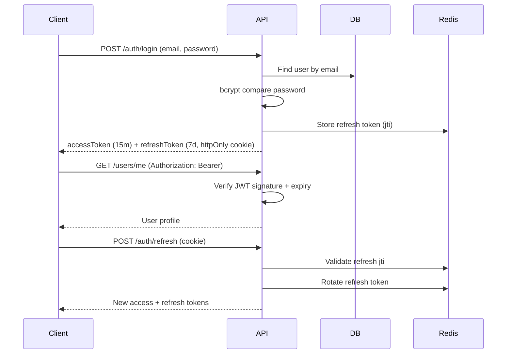

### 10.2 Token Strategy

| Token | Storage | Lifetime | Rotation |
|-------|---------|----------|----------|
| Access (JWT) | Memory / Authorization header | 15 minutes | On refresh |
| Refresh | httpOnly secure cookie | 7 days | On each refresh |

**JWT payload:** `{ sub, email, role, plan, iat, exp }`

### 10.3 OAuth Providers

| Provider | Use Case | Phase |
|----------|----------|-------|
| Google | Consumer sign-up | Phase 2 |
| GitHub | Developer sign-up | Phase 2 |
| SAML 2.0 | Enterprise SSO | Phase 8 |
| OIDC | Enterprise SSO | Phase 8 |

### 10.4 RBAC Permission Matrix

| Permission | Guest | Free | Pro | Team | Enterprise | Content Admin | Super Admin |
|------------|-------|------|-----|------|------------|---------------|-------------|
| Execute SQL (browser) | Yes | Yes | Yes | Yes | Yes | Yes | Yes |
| Save progress | No | Yes | Yes | Yes | Yes | Yes | Yes |
| Premium challenges | No | No | Yes | Yes | Yes | Yes | Yes |
| Platform AI | No | No | Yes | Yes | Yes | No | Yes |
| BYOK AI | No | Yes | Yes | Yes | Yes | No | Yes |
| Certificates (premium) | No | No | Yes | Yes | Yes | Yes | Yes |
| Team dashboard | No | No | No | Yes | Yes | No | Yes |
| SSO | No | No | No | No | Yes | No | Yes |
| Admin CRUD | No | No | No | No | No | Yes | Yes |

### 10.5 Session Security

- CSRF protection on cookie-based endpoints
- SameSite=Strict on refresh cookie
- Device fingerprint logging (optional)
- Concurrent session limit: 5 per user
- Force logout on password change

---

## 11. AI Architecture

### 11.1 Core Principle

**AI is an optional enhancement layer.** The platform MUST deliver full learning value with `AI_ENABLED=false`. All AI endpoints return `503 AI_UNAVAILABLE` when disabled — core flows continue unaffected.

### 11.2 AI Feature Matrix

| Feature | Description | Input Context | Tier Required |
|---------|-------------|---------------|---------------|
| **AI Tutor** | Explains SQL concepts | Challenge concept, instructions, optional user question | Pro or BYOK |
| **AI Debugger** | Diagnoses failed queries | User SQL, error message, schema, expected result | Pro or BYOK |
| **AI Reviewer** | Reviews solution quality | User SQL, result, best practices rubric | Pro or BYOK |
| **AI Coach** | Creates personalized learning plans | Progress data, weak concepts, goals | Pro or BYOK |

### 11.3 Provider Abstraction Layer

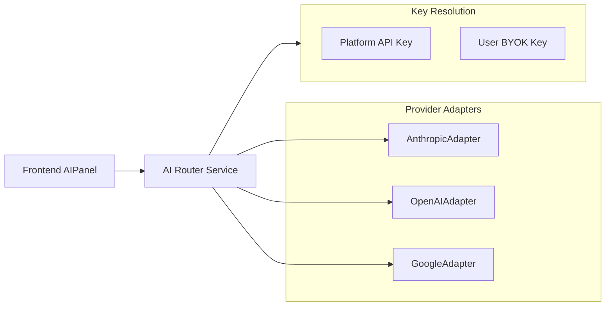

**Interface:**

```typescript
interface AIProviderAdapter {
  name: AIProvider;
  complete(request: AICompletionRequest): Promise<AICompletionResponse>;
  stream(request: AICompletionRequest): AsyncIterable<string>;
  listModels(): Promise<AIModel[]>;
  validateKey(apiKey: string): Promise<boolean>;
}

interface AICompletionRequest {
  feature: 'tutor' | 'debugger' | 'reviewer' | 'coach';
  messages: AIMessage[];
  model?: string;
  maxTokens?: number;
  temperature?: number;
}
```

**No provider-specific code outside adapter implementations.**

### 11.4 Provider Configuration

| Provider | Default Model | SDK |
|----------|---------------|-----|
| Anthropic (Claude) | claude-sonnet-4-20250514 | `@anthropic-ai/sdk` |
| OpenAI | gpt-4o | `openai` |
| Google (Gemini) | gemini-2.0-flash | `@google/generative-ai` |

### 11.5 Request Routing Logic

```
1. Check AI_ENABLED platform flag → if false, return 503
2. Check user plan → Free without BYOK → return 403 UPGRADE_REQUIRED
3. Resolve API key:
   a. If user has active BYOK for preferred provider → use BYOK key
   b. Else if user is Pro+ → use platform key
   c. Else → return 403
4. Attempt request with preferred provider + model
5. On failure → try next configured provider (if BYOK multi-provider)
6. On all failures → return graceful error; core app unaffected
7. Log usage (tokens, feature, provider, key source) — never log key
```

### 11.6 BYOK Architecture

| Aspect | Design |
|--------|--------|
| Storage | AES-256-GCM encrypted in `BYOKKey.encryptedKey` |
| Encryption key | AWS KMS / Supabase Vault envelope encryption |
| Key hint | Last 4 characters shown in UI (e.g., `sk-...abc4`) |
| Validation | Test API call on save; reject invalid keys |
| Deletion | Immediate; no soft delete |
| Audit | Log key added/removed events (not key value) |

**User settings (`/settings/ai`):**

- Preferred provider dropdown
- Preferred model dropdown (filtered by provider)
- Per-provider key input fields
- Failover order drag-and-drop
- "Test connection" button per provider

### 11.7 Prompt Templates

Stored in admin AI Management; rendered server-side with variables:

| Template | Variables |
|----------|-----------|
| `tutor` | `{{concept}}`, `{{instructions}}`, `{{userQuestion}}` |
| `debugger` | `{{sql}}`, `{{error}}`, `{{schema}}`, `{{expectedResult}}` |
| `reviewer` | `{{sql}}`, `{{result}}`, `{{rubric}}` |
| `coach` | `{{completedChallenges}}`, `{{weakConcepts}}`, `{{goal}}` |

**Global suffix (all templates):** "Be encouraging and concise. Use plain language. No markdown headers."

### 11.8 Quota & Rate Limiting

| Tier | Platform AI Quota | BYOK |
|------|-------------------|------|
| Free | 0 | Unlimited (user credits) |
| Pro | 100 requests/day | Unlimited (user credits) |
| Team | 200 requests/day per seat | Unlimited |
| Enterprise | Custom | Unlimited |

- Redis counter: `ai:quota:{userId}:{date}` with TTL 48h
- Rate limit: 10 requests/minute per user
- Token budget: max 4,000 tokens per request

### 11.9 AI UI Behavior (Frontend)

| State | UI |
|-------|-----|
| AI disabled (platform) | AI panel hidden entirely |
| Free user, no BYOK | Panel shows upgrade CTA + BYOK option |
| Free user, BYOK configured | Panel fully functional |
| Pro user | Panel functional with quota indicator |
| Quota exceeded | "Daily limit reached" + BYOK suggestion |
| Request in flight | Streaming text in panel |
| Request failed | Error message + retry; challenge flow unaffected |

---

## 12. Monetization Design

### 12.1 Plan Comparison

| Feature | Free | Pro ($19/mo) | Team ($49/mo/seat) | Enterprise (Custom) |
|---------|------|--------------|---------------------|---------------------|
| Browser SQL execution | Yes | Yes | Yes | Yes |
| Free learning paths | Yes | Yes | Yes | Yes |
| Save progress | Yes | Yes | Yes | Yes |
| XP, achievements, streaks | Yes | Yes | Yes | Yes |
| Community datasets | Yes | Yes | Yes | Yes |
| Daily challenges | Yes | Yes | Yes | Yes |
| Basic certificates | Yes | Yes | Yes | Yes |
| Advanced/Expert challenges | No | Yes | Yes | Yes |
| Premium certificates | No | Yes | Yes | Yes |
| Platform AI (tutor/debug/review/coach) | No | 100/day | 200/day/seat | Custom |
| BYOK | Yes | Yes | Yes | Yes |
| Ad-free | No | Yes | Yes | Yes |
| Team dashboard | No | No | Yes | Yes |
| Assigned learning paths | No | No | Yes | Yes |
| SSO/SAML | No | No | No | Yes |
| Custom branding | No | No | No | Yes |
| Custom datasets | No | No | No | Yes |
| LMS integration | No | No | No | Yes |
| SLA | No | No | No | Yes |
| Priority support | No | Email | Email | Dedicated |

### 12.2 Stripe Integration

| Stripe Object | Mapping |
|---------------|---------|
| Product: `pro_monthly` | Pro plan |
| Product: `team_seat_monthly` | Team plan per seat |
| Customer | `Subscription.stripeCustomerId` |
| Subscription | `Subscription.stripeSubscriptionId` |
| Webhook events | `checkout.session.completed`, `customer.subscription.updated`, `customer.subscription.deleted`, `invoice.payment_failed` |

### 12.3 Feature Gating

```typescript
function canAccess(feature: Feature, user: User): boolean {
  const matrix = FEATURE_MATRIX[user.plan];
  return matrix[feature] ?? false;
}
```

- Frontend: `<PremiumGate feature="ai_tutor">` component
- Backend: `@RequiresPlan('PRO')` decorator on controllers
- Challenge `isPremium` flag checked on attempt submission

### 12.4 Revenue Streams

| Stream | Description |
|--------|-------------|
| Pro subscriptions | Primary B2C revenue |
| Team subscriptions | B2B small teams |
| Enterprise contracts | Annual contracts, custom pricing |
| Certification fees | Optional paid exam attempts (future) |
| Affiliate partnerships | Database tool referrals (future) |

---

## 13. Analytics System

### 13.1 Event Taxonomy

| Category | Events |
|----------|--------|
| **Navigation** | `page.viewed`, `path.started`, `challenge.opened` |
| **Learning** | `challenge.attempted`, `challenge.completed`, `challenge.failed`, `hint.revealed`, `solution.revealed` |
| **Workspace** | `workspace.query_executed`, `workspace.dataset_changed` |
| **Gamification** | `xp.earned`, `achievement.unlocked`, `streak.updated`, `level.up` |
| **AI** | `ai.tutor_requested`, `ai.debugger_requested`, `ai.quota_exceeded` |
| **Auth** | `user.registered`, `user.logged_in`, `subscription.started`, `subscription.cancelled` |
| **Admin** | `admin.challenge.published`, `admin.dataset.created` |

### 13.2 Event Schema

```typescript
interface AnalyticsEvent {
  event: string;
  userId?: string;
  sessionId: string;
  timestamp: string;
  properties: {
    challengeId?: string;
    pathId?: string;
    difficulty?: string;
    durationMs?: number;
    hintLevel?: number;
    passed?: boolean;
    aiFeature?: string;
    aiProvider?: string;
    [key: string]: unknown;
  };
}
```

### 13.3 Ingestion Pipeline

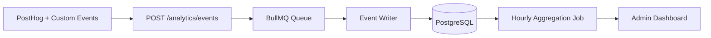

- Client: PostHog for product analytics + custom events to API for admin dashboards
- Batch ingestion: up to 50 events per request
- Guest events: sessionId only, no userId

### 13.4 Dashboards

#### Learner Dashboard (`/progress`)

- Challenges completed over time
- Concept mastery radar chart
- Time spent per week
- Streak calendar

#### Admin Dashboard (`/admin/analytics`)

| Dashboard | Metrics |
|-----------|---------|
| **Completion Funnel** | Started → Attempted → Completed per challenge |
| **Drop-off Heatmap** | Challenge × abandonment rate |
| **Hint Usage** | Hint level distribution per challenge |
| **AI Usage** | Requests by feature, provider, plan tier |
| **Cohort Retention** | D1, D7, D30 retention by signup week |
| **Revenue** | MRR, churn, conversion funnel |
| **Failed Challenges** | Top 10 by failure rate with error categories |

---

## 14. Challenge System

### 14.1 Challenge Data Model

```typescript
interface Challenge {
  id: string;
  slug: string;
  title: string;
  concept: string;           // e.g., "JOIN", "CTE", "WINDOW_FUNCTION"
  instructions: string;      // Markdown
  difficulty: Difficulty;    // BEGINNER | INTERMEDIATE | ADVANCED | EXPERT
  dialect: SQLDialect;       // SQLITE | POSTGRESQL | MYSQL | STANDARD
  xpReward: number;
  datasetId: string;
  moduleId?: string;
  solution?: string;         // Reference solution (revealed after N attempts)
  isPremium: boolean;
  hints: Hint[];             // Progressive levels 1-3
  validationRules: ValidationRule[];
}
```

### 14.2 Difficulty Tiers

| Tier | v1 Mapping | Concepts | Target Audience |
|------|------------|----------|-----------------|
| **Beginner** | Beginner (6) | SELECT, WHERE, COUNT, ORDER BY, LIMIT | No SQL experience |
| **Intermediate** | Analyst (6) | JOIN, GROUP BY, AVG, HAVING, aggregates | Basic SQL knowledge |
| **Advanced** | Advanced (3) + new | Subqueries, CTEs, self-joins, window functions | Comfortable with joins |
| **Expert** | New | Recursive CTEs, complex window functions, optimization | Professional analysts |

### 14.3 SQL Dialect Support

| Dialect | Execution Environment | Phase |
|---------|----------------------|-------|
| **SQLite** | Browser (sql.js) | Phase 1 (existing) |
| **PostgreSQL** | Server-side (Supabase SQL or dedicated instance) | Phase 4 |
| **MySQL** | Server-side (Docker sandbox) | Phase 4 |
| **Standard** | Validated structurally; executed as SQLite | Phase 1 |

### 14.4 Validation System

**Multi-layer validation engine** — replaces v1 `check(rows)` functions.

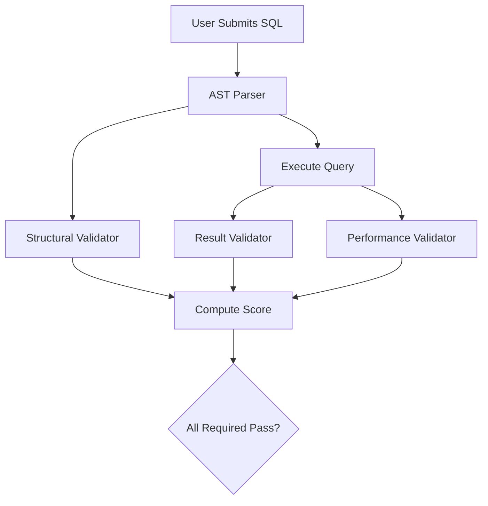

#### Layer 1: AST Structural Validation

Uses `node-sql-parser` to detect:

| Rule Type | Example Config |
|-----------|----------------|
| `KEYWORD_REQUIRED` | `{ keyword: "JOIN" }` |
| `TABLE_USAGE` | `{ tables: ["employees", "departments"] }` |
| `AST_STRUCTURE` | `{ mustContain: ["groupBy", "having"] }` |
| `FORBIDDEN_KEYWORD` | `{ keywords: ["DROP", "DELETE", "INSERT"] }` |
| `CTE_USAGE` | `{ required: true }` |
| `WINDOW_FUNCTION` | `{ required: true }` |
| `JOIN_TYPE` | `{ type: "INNER" }` |

#### Layer 2: Result Validation

| Rule Type | Example Config |
|-----------|----------------|
| `ROW_COUNT` | `{ exact: 5 }` |
| `COLUMN_NAMES` | `{ columns: ["name", "hire_date"], forbidden: ["id"] }` |
| `COLUMN_VALUES` | `{ column: "name", values: ["Eve"] }` |
| `SORT_ORDER` | `{ column: "name", direction: "ASC" }` |
| `RESULT_SET` | `{ match: "expected.json", tolerance: "exact" }` |
| `AGGREGATE_VALUE` | `{ column: "avg_salary", value: 94000, tolerance: 0 }` |

#### Layer 3: Performance Validation (Expert)

| Rule Type | Example Config |
|-----------|----------------|
| `NO_CROSS_JOIN` | `{ enabled: true }` |
| `MAX_EXECUTION_MS` | `{ max: 1000 }` |
| `INDEX_HINT` | `{ table: "employees", column: "dept_id" }` |

#### Validation Response

```typescript
interface ValidationResult {
  passed: boolean;
  layers: {
    ast: { passed: boolean; failures: string[] };
    result: { passed: boolean; failures: string[] };
    structural: { passed: boolean; failures: string[] };
    performance: { passed: boolean; failures: string[] };
  };
  feedback: string;
  xpEarned: number;
}
```

### 14.5 Database Reset Strategy

- On challenge mount: clone seed snapshot into isolated sql.js instance
- On each Run: execute against clone (not shared DB)
- On challenge unmount: destroy instance
- Prevents v1 bug where DROP/INSERT corrupts subsequent challenges

### 14.6 Hint System

| Level | Content | XP Penalty |
|-------|---------|------------|
| 1 | Nudge (concept reminder) | 0% |
| 2 | Structure hint (partial SQL) | -10% XP |
| 3 | Near-solution hint | -25% XP |

### 14.7 Solution Reveal

- Available after 5 failed attempts
- XP reduced to 25% of base
- Marked as "assisted completion" in analytics
- Does not block progression

---

## 15. Gamification System

### 15.1 XP System

| Action | Base XP | Modifiers |
|--------|---------|-----------|
| Complete challenge (first pass) | 10–50 (by difficulty) | Hint penalty, assisted penalty |
| Daily challenge bonus | +20 | — |
| Achievement bonus | 5–100 | Per achievement |
| Streak milestone (7, 30, 100 days) | 50–500 | — |

**XP → Level formula:** `level = floor(sqrt(xp / 100))`

| Level | XP Required | Title |
|-------|-------------|-------|
| 1 | 0 | Novice |
| 2 | 100 | Apprentice |
| 3 | 400 | Practitioner |
| 4 | 900 | Analyst |
| 5 | 1600 | Expert |
| 6+ | n² × 100 | Master+ |

### 15.2 Streaks

- Daily streak: complete ≥1 challenge or daily challenge per UTC day
- Streak freeze: 1 per month (Pro+)
- Streak displayed on dashboard and profile
- Streak achievements at 7, 30, 100, 365 days

### 15.3 Achievements

| Slug | Title | Rule |
|------|-------|------|
| `first-query` | Hello, SQL! | Complete first challenge |
| `join-master` | Join Master | Complete 10 JOIN challenges |
| `streak-7` | Week Warrior | 7-day streak |
| `no-hints` | Pure Skill | Complete 5 challenges without hints |
| `speed-demon` | Speed Demon | Complete challenge in < 60s |
| `all-beginner` | Foundation Built | Complete all Beginner challenges |
| `cte-explorer` | CTE Explorer | Complete all CTE challenges |
| `daily-30` | Daily Grinder | Complete 30 daily challenges |

**Achievement rule engine (JSON):**

```json
{
  "type": "count",
  "event": "challenge.completed",
  "filter": { "concept": "JOIN" },
  "threshold": 10
}
```

### 15.4 Skill Tree

```
SQL Fundamentals
├── SELECT (b1-b2)
├── FILTERING (b3)
├── AGGREGATES (b4, a2, a3)
├── SORTING & LIMITING (b5-b6)
├── JOINS (a1, a4, a5)
├── GROUPING (a2, a5, a6)
├── SUBQUERIES (adv1)
├── CTEs (adv3)
└── WINDOW FUNCTIONS (new)
```

- Nodes unlock on concept mastery (≥80% of concept challenges completed)
- Visualized as interactive tree on `/progress`
- No AI required for skill tree updates

### 15.5 Badges

- Displayed on profile and leaderboard
- Earned from achievements
- Rarity tiers: Common, Rare, Epic, Legendary
- Shareable as images (OG card generation)

### 15.6 Daily Challenges

- Rotates at 00:00 UTC
- Selected from published challenge pool
- Bonus XP (+20)
- Available to all registered users
- Guest can view but not earn XP

---

## 16. Admin Platform

### 16.1 No-Code Content Management

Administrators create and manage all content through the admin portal — **zero source code edits required**.

### 16.2 Challenge Builder Workflow

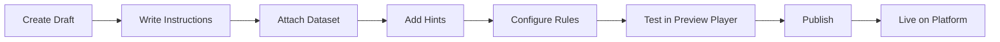

**Challenge Builder fields:**

| Field | Type | Required |
|-------|------|----------|
| Title | Text | Yes |
| Slug | Auto-generated | Yes |
| Concept | Select from taxonomy | Yes |
| Instructions | Markdown editor | Yes |
| Difficulty | Select | Yes |
| Dialect | Select | Yes |
| Dataset | Picker | Yes |
| XP Reward | Number | Yes |
| Premium | Toggle | No |
| Hints (1-3) | Text per level | Yes |
| Validation Rules | Rule builder UI | Yes |
| Solution | SQL editor | No |
| Expected Result | JSON preview | Yes |

### 16.3 Validation Rule Builder UI

Visual rule builder — no JSON editing required:

1. Click "Add Rule"
2. Select rule type (dropdown)
3. Fill type-specific fields (form)
4. Toggle required/optional
5. Preview with test SQL

### 16.4 Dataset Builder Workflow

1. **Upload** — SQL file or CSV per table
2. **Preview** — Auto-parse schema
3. **Validate** — Run integrity checks (PKs, FKs, row counts)
4. **Test** — Execute sample queries in preview
5. **Publish** — Available for challenge attachment

### 16.5 Learning Path Manager

- Drag-and-drop module ordering
- Drag-and-drop challenge ordering within modules
- Prerequisite configuration
- Premium/free toggle per path

### 16.6 Achievement Manager

- Create achievement with icon upload
- Configure rule via visual builder
- Set XP bonus and rarity
- Preview trigger conditions

### 16.7 User Management

- Search by email, username, ID
- View progress, attempts, subscription
- Change role (super admin only)
- Ban/suspend account
- Impersonate (super admin, audit logged)

---

## 17. Deployment Architecture

### 17.1 Production Topology

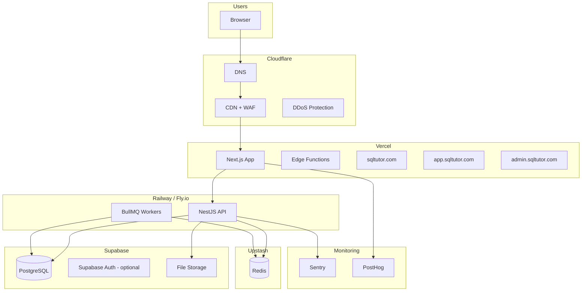

### 17.2 Environment Strategy

| Environment | Frontend | Backend | Database |
|-------------|----------|---------|----------|
| Development | localhost:3000 | localhost:4000 | Local PostgreSQL |
| Staging | staging.sqltutor.com | api-staging.sqltutor.com | Supabase staging |
| Production | app.sqltutor.com | api.sqltutor.com | Supabase production |

### 17.3 CI/CD Pipeline

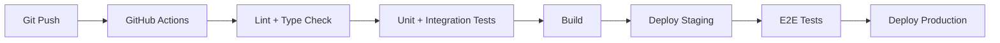

**GitHub Actions workflows:**

| Workflow | Trigger | Steps |
|----------|---------|-------|
| `ci.yml` | PR + push to main | lint, typecheck, test, build |
| `deploy-frontend.yml` | push to main | Vercel deploy |
| `deploy-backend.yml` | push to main | Railway/Fly deploy |
| `e2e.yml` | post staging deploy | Playwright tests |

### 17.4 Infrastructure Components

| Component | Provider | Purpose |
|-----------|----------|---------|
| Frontend hosting | Vercel | Next.js SSR/SSG, edge functions |
| Backend hosting | Railway or Fly.io | NestJS API + workers |
| Database | Supabase (PostgreSQL) | Primary data store |
| Cache / Queue | Upstash Redis | Sessions, rate limits, BullMQ |
| File storage | Supabase Storage | Avatars, certificates, dataset uploads |
| CDN / WAF | Cloudflare | DNS, caching, DDoS protection |
| Error tracking | Sentry | Frontend + backend errors |
| Product analytics | PostHog | Funnels, retention, feature flags |
| Payments | Stripe | Subscriptions, invoicing |
| Email | Resend | Transactional email |
| Secrets | Supabase Vault / Doppler | API keys, encryption keys |

### 17.5 Domain Configuration

| Domain | App | SSL |
|--------|-----|-----|
| `sqltutor.com` | Marketing (Next.js) | Cloudflare |
| `app.sqltutor.com` | Application (Next.js) | Cloudflare |
| `admin.sqltutor.com` | Admin (Next.js) | Cloudflare |
| `api.sqltutor.com` | Backend (NestJS) | Cloudflare |

---

## 18. Security Requirements

### 18.1 OWASP Top 10 Mitigations

| Risk | Mitigation |
|------|------------|
| **A01 Broken Access Control** | RBAC guards on all endpoints; plan-based feature gating; admin audit logs |
| **A02 Cryptographic Failures** | TLS everywhere; bcrypt passwords; AES-256-GCM for BYOK keys |
| **A03 Injection** | Prisma parameterized queries; SQL parser for validation only (not execution on server for user SQL); input validation via Zod |
| **A04 Insecure Design** | AI optional by design; DB reset per challenge; rate limiting |
| **A05 Security Misconfiguration** | Hardened headers (CSP, HSTS, X-Frame-Options); no default credentials |
| **A06 Vulnerable Components** | Dependabot; `npm audit` in CI; pinned dependencies |
| **A07 Auth Failures** | JWT rotation; rate-limited login; secure cookies; MFA (Phase 8) |
| **A08 Data Integrity** | Webhook signature verification (Stripe); signed certificate codes |
| **A09 Logging Failures** | Structured logging; audit trail for admin actions; Sentry alerts |
| **A10 SSRF** | AI provider URLs hardcoded; no user-controlled fetch URLs |

### 18.2 API Rate Limiting

| Endpoint Category | Limit |
|-------------------|-------|
| Auth (login/register) | 5 req / 15 min per IP |
| Public API | 60 req / min per IP |
| Authenticated API | 120 req / min per user |
| AI endpoints | 10 req / min per user |
| Analytics ingestion | 100 events / min per session |
| Admin API | 300 req / min per admin |

Implementation: Redis sliding window (`@nestjs/throttler`).

### 18.3 Encryption

| Data | At Rest | In Transit |
|------|---------|------------|
| Passwords | bcrypt (cost 12) | TLS 1.2+ |
| BYOK API keys | AES-256-GCM (KMS-managed key) | TLS 1.2+ |
| JWT tokens | N/A (signed, short-lived) | TLS 1.2+ |
| Database | Supabase encryption at rest | TLS |
| Certificates (PDF) | S3 server-side encryption | TLS |

### 18.4 Audit Logging

| Action | Logged Fields |
|--------|---------------|
| Admin content changes | actor, action, resource, timestamp, diff |
| User role changes | actor, target, oldRole, newRole |
| BYOK key add/remove | userId, provider, action (never key value) |
| Admin impersonation | admin, target, start, end |
| Subscription changes | userId, oldPlan, newPlan, source |

Retention: 2 years for compliance.

### 18.5 Content Security Policy

```
default-src 'self';
script-src 'self' 'wasm-unsafe-eval';
style-src 'self' 'unsafe-inline';
connect-src 'self' https://api.sqltutor.com;
img-src 'self' data: https:;
font-src 'self';
frame-ancestors 'none';
```

Note: No AI provider URLs in CSP — all AI calls proxied through backend.

### 18.6 Browser SQL Sandbox

- sql.js runs in WebAssembly sandbox (browser memory only)
- No network access from SQL engine
- Seed data only — no user data in browser DB
- DDL/DML blocked via AST validation before execution
- Per-challenge isolated DB instance

---

## 19. Scalability Requirements

### 19.1 Scaling Targets

| Dimension | Year 1 | Year 3 |
|-----------|--------|--------|
| Registered users | 100K | 1M |
| Concurrent users | 5K | 50K |
| Challenges in catalog | 200 | 10K |
| API requests/sec | 500 | 5K |
| Analytics events/day | 1M | 50M |
| AI requests/day | 50K | 500K |

### 19.2 Scaling Strategy

| Component | Strategy |
|-----------|----------|
| Frontend (Vercel) | Auto-scales; edge caching for static assets |
| Backend (NestJS) | Horizontal pods behind load balancer; stateless |
| PostgreSQL | Read replicas for analytics queries; connection pooling (PgBouncer) |
| Redis | Upstash auto-scaling |
| sql.js execution | Client-side — scales with users (zero server cost) |
| Server-side SQL (PG/MySQL) | Dedicated sandbox instances with connection limits (Phase 4) |
| AI requests | Queue-based (BullMQ) with worker pool; provider rate limit awareness |
| File storage | CDN-backed; no transform needed |
| Analytics | Async ingestion → batch writes; hourly rollups |

### 19.3 Caching Strategy

| Data | Cache | TTL |
|------|-------|-----|
| Challenge list | Redis | 5 min |
| Challenge detail | Redis | 5 min |
| Dataset schema | Redis | 1 hour |
| User profile | Redis | 1 min |
| Leaderboard | Redis | 5 min |
| Static assets | Cloudflare CDN | 1 year |

### 19.4 Database Optimization

- Indexes on: `challenges.slug`, `attempts(userId, challengeId)`, `analytics_events(event, createdAt)`
- Partition `analytics_events` by month (after 6 months)
- Archive completed attempts older than 1 year to cold storage
- Materialized views for leaderboard and admin dashboards

### 19.5 Multi-Region (Future)

| Phase | Scope |
|-------|-------|
| Year 1 | Single region (US-East) |
| Year 2 | CDN global; DB primary + read replica (EU) |
| Year 3 | Multi-region active-passive |

---

## 20. Development Roadmap

### Phase Overview

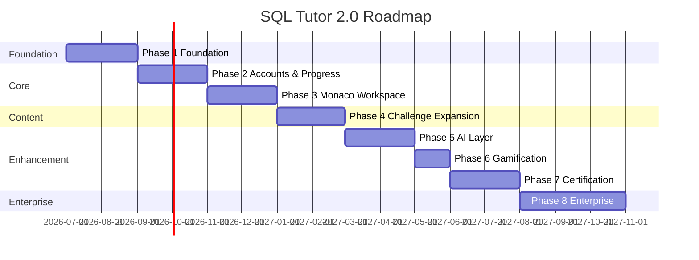

---

### Phase 1: Foundation (Months 1–2)

**Goals:** Establish production infrastructure; migrate core v1 functionality to new stack.

| Category | Items |
|----------|-------|
| **Features** | Challenge player (no AI), schema browser, result viewer, track browsing, browser SQL execution |
| **Technical** | Next.js project scaffold; NestJS project scaffold; Prisma schema (core tables); sql.js npm integration; Tailwind + shadcn/ui; CI/CD pipeline; seed migration of 15 v1 challenges |
| **Dependencies** | None |
| **Effort** | 2 engineers × 2 months |
| **Risks** | sql.js bundling with Vite/Next.js; WASM load time regression |

**Exit criteria:**
- All 15 v1 challenges playable in new UI
- DB reset per challenge working
- Deployed to staging
- Lighthouse score > 85

---

### Phase 2: Accounts & Progress (Months 3–4)

**Goals:** User accounts, cloud progress sync, URL routing.

| Category | Items |
|----------|-------|
| **Features** | Registration, login, OAuth (Google, GitHub), progress sync, resume position, challenge URLs, guest mode (3 challenges) |
| **Technical** | Auth module (JWT + refresh); User/Progress services; Prisma migrations; protected routes; session management; `.gitignore`, lockfile, `.env.example` |
| **Dependencies** | Phase 1 |
| **Effort** | 2 engineers × 2 months |
| **Risks** | Auth security vulnerabilities; migration from localStorage for existing users (N/A for new platform) |

**Exit criteria:**
- Users can register, login, save progress across devices
- Shareable challenge URLs work
- Guest mode functional

---

### Phase 3: Monaco SQL Workspace (Months 5–6)

**Goals:** Professional SQL editing experience; sandbox workspace.

| Category | Items |
|----------|-------|
| **Features** | Monaco editor, syntax highlighting, IntelliSense, SQL formatter, query history, split panel, execution stats, free workspace page |
| **Technical** | `@monaco-editor/react` integration; custom completion provider; `sql-formatter`; resizable panels; query history API; responsive layout breakpoints |
| **Dependencies** | Phase 2 |
| **Effort** | 2 engineers × 2 months |
| **Risks** | Monaco bundle size; mobile editor UX |

**Exit criteria:**
- Monaco editor in challenge player and workspace
- IntelliSense works for all seed datasets
- Mobile layout usable

---

### Phase 4: Challenge Expansion (Months 7–8)

**Goals:** Multi-layer validation; expanded content; admin challenge builder.

| Category | Items |
|----------|-------|
| **Features** | AST validation, structural validation, 50+ challenges, Expert tier, admin challenge builder, admin dataset builder, solution reveal |
| **Technical** | Validation engine (`node-sql-parser`); ValidationRule schema; admin CRUD APIs; dataset upload; challenge preview player; validation unit tests (100% coverage) |
| **Dependencies** | Phase 3 |
| **Effort** | 2 engineers + 1 content author × 2 months |
| **Risks** | AST parser dialect differences; content creation bottleneck |

**Exit criteria:**
- Zero gameable challenges in catalog
- Admin can create and publish challenge without code
- 50+ challenges live

---

### Phase 5: AI Layer (Months 9–10)

**Goals:** Optional AI features with provider abstraction and BYOK.

| Category | Items |
|----------|-------|
| **Features** | AI Tutor, AI Debugger, AI Reviewer, AI Coach, BYOK, provider failover, quota system |
| **Technical** | AI Service module; 3 provider adapters; encryption for BYOK; SSE streaming; AI admin panel; quota Redis counters |
| **Dependencies** | Phase 4 |
| **Effort** | 2 engineers × 2 months |
| **Risks** | Provider API changes; cost overruns without quota; prompt quality |

**Exit criteria:**
- Platform fully functional with `AI_ENABLED=false`
- All 4 AI features work with Pro plan
- BYOK works for all 3 providers
- Quota enforcement verified

---

### Phase 6: Gamification (Months 11–12)

**Goals:** XP, levels, streaks, achievements, skill tree, daily challenges, leaderboard.

| Category | Items |
|----------|-------|
| **Features** | XP system, levels, streaks, 20+ achievements, skill tree visualization, daily challenges, public leaderboard |
| **Technical** | Achievement rule engine; XP calculation service; streak cron job; leaderboard Redis sorted set; achievement notification system |
| **Dependencies** | Phase 2 (accounts) |
| **Effort** | 1 engineer × 1 month |
| **Risks** | XP inflation; streak timezone edge cases |

**Exit criteria:**
- XP awarded on challenge completion
- Achievements unlock automatically
- Leaderboard updates in real-time

---

### Phase 7: Certification (Months 13–14)

**Goals:** Exams, certificates, public verification.

| Category | Items |
|----------|-------|
| **Features** | Timed exams, certificate PDF generation, public verification pages, basic + premium certificates |
| **Technical** | Exam assembly engine; timed session management; PDF generation (Puppeteer); verification API; certificate OG cards |
| **Dependencies** | Phase 4, Phase 6 |
| **Effort** | 2 engineers × 2 months |
| **Risks** | Exam integrity (cheating); PDF generation at scale |

**Exit criteria:**
- Users can take exams and earn certificates
- Public verification URL works
- Premium certificates gated correctly

---

### Phase 8: Enterprise Features (Months 15–17)

**Goals:** Teams, SSO, custom branding, LMS integration, analytics.

| Category | Items |
|----------|-------|
| **Features** | Team plans, team dashboard, SSO/SAML, custom branding, LMS (SCORM), enterprise analytics, audit log export |
| **Technical** | Team module; Stripe team billing; SAML integration; white-label theming; SCORM package generator; enterprise admin roles |
| **Dependencies** | Phase 7, Phase 5 |
| **Effort** | 3 engineers × 3 months |
| **Risks** | SAML complexity; LMS standards compliance; enterprise sales cycle |

**Exit criteria:**
- Team admin can invite members and assign paths
- SSO login works with Okta/Azure AD
- SCORM package exportable

---

### Roadmap Summary Table

| Phase | Duration | Engineers | Key Deliverable | AI Required? |
|-------|----------|-----------|-----------------|--------------|
| 1 Foundation | 2 months | 2 | v1 challenges in new stack | No |
| 2 Accounts | 2 months | 2 | Auth + progress sync | No |
| 3 Monaco | 2 months | 2 | Professional SQL editor | No |
| 4 Challenges | 2 months | 3 | 50+ challenges + validation | No |
| 5 AI Layer | 2 months | 2 | Optional AI + BYOK | Optional |
| 6 Gamification | 1 month | 1 | XP, achievements, leaderboard | No |
| 7 Certification | 2 months | 2 | Exams + certificates | No |
| 8 Enterprise | 3 months | 3 | Teams, SSO, LMS | No |
| **Total** | **16 months** | **Peak 3** | **Production SaaS platform** | **No** |

---

## Appendix A: v1 → v2 Feature Mapping

| v1 Feature | v2 Equivalent | Status |
|------------|---------------|--------|
| Track switcher (3 tracks) | Learning Paths with 4 difficulty tiers | Enhanced |
| Sidebar challenge list | Challenge Explorer + Path modules | Enhanced |
| Progress bar (per track) | Progress Center + skill tree | Enhanced |
| Schema panel | Schema Browser in Monaco workspace | Enhanced |
| Textarea SQL editor | Monaco SQL Workspace | Replaced |
| Run / Reset / Hint buttons | Challenge Player toolbar | Preserved |
| Row-only validation | Multi-layer Validation Engine | Replaced |
| localStorage progress | Cloud-synced Progress Service | Replaced |
| AI explain button | AI Tutor (optional, gated) | Enhanced |
| Celebration emoji | Achievement system + animations | Enhanced |
| Result table | Result Viewer with stats + export | Enhanced |
| `challenges.js` data | PostgreSQL + Admin Builder | Migrated |

## Appendix B: Technology Decision Records

| Decision | Choice | Rationale |
|----------|--------|-----------|
| Frontend framework | Next.js over Vite SPA | SSR for marketing, API routes, file-based routing |
| Backend framework | NestJS over Express | Module structure, DI, enterprise patterns |
| Database | PostgreSQL over MongoDB | Relational data model, Prisma support, Supabase |
| SQL in browser | sql.js (keep) | Zero server cost, instant execution, proven in v1 |
| SQL editor | Monaco over CodeMirror | IntelliSense, formatting, VS Code familiarity |
| AI coupling | Provider abstraction | Multi-provider, BYOK, no vendor lock-in |
| CSS | Tailwind + shadcn over inline styles | Responsive, maintainable, accessible components |
| Analytics | PostHog + custom events | Product analytics + admin-specific dashboards |
| Payments | Stripe | Industry standard, subscription support |

## Appendix C: Glossary

| Term | Definition |
|------|------------|
| **BYOK** | Bring Your Own Key — user provides their own AI API key |
| **Challenge** | A single SQL exercise with instructions, dataset, and validation |
| **Dataset** | A collection of tables with seed data used by challenges |
| **Learning Path** | Ordered collection of modules and challenges |
| **Validation Engine** | Multi-layer system checking AST, results, and structure |
| **Skill Tree** | Visual map of concept mastery progress |
| **BYOK** | Bring Your Own (AI) Key |

---

*End of SQL Tutor 2.0 Platform Transformation Specification.*

*This document defines the complete architecture for transforming the SQL Tutor prototype into a production-grade SaaS learning platform. AI is optional. The core platform delivers full educational value without any AI dependency.*

