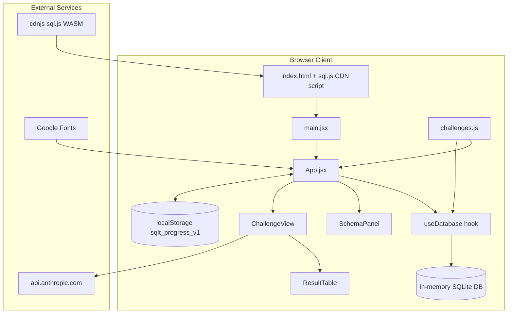
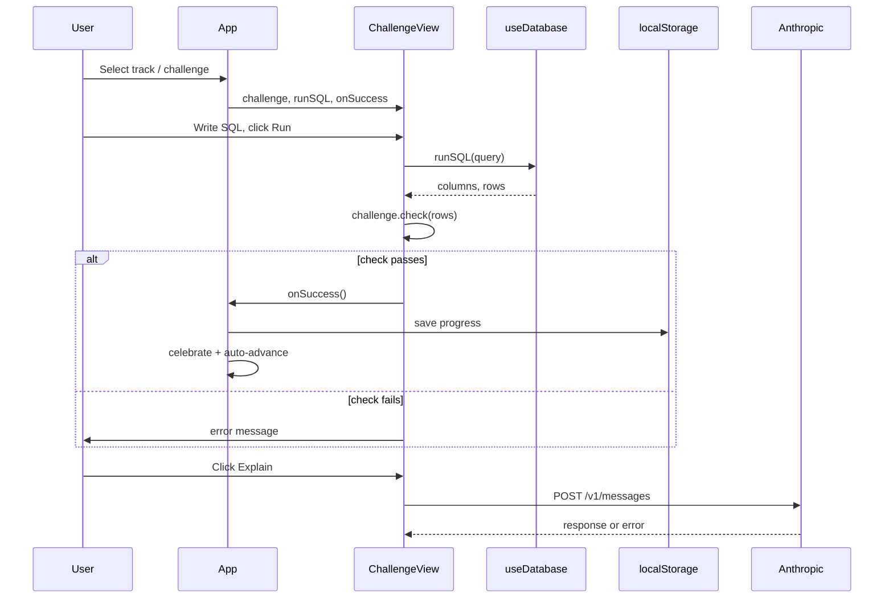
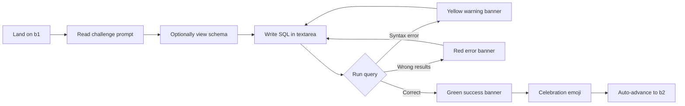

# SQL Tutor — Full Project Audit

**Audit date:** June 9, 2026  
**Project path:** `C:\Users\Davea\Downloads\Telegram Desktop\sql-tutor\sql-tutor`  
**Auditor role:** Senior Staff Software Engineer — read-only assessment  
**Version audited:** `1.0.0` (per `package.json`)

---

## Executive Summary

SQL Tutor is a **small, client-only React SPA** (~11 source files, ~1,000 LOC) that teaches SQL through 15 interactive challenges across three difficulty tracks. The core learning loop — write SQL, execute in-browser, see results, pass/fail validation — **works and is usable as a local prototype**.

However, the application is **not production-ready**. The advertised AI tutor feature is broken as shipped, answer validation is easily gameable, there is no test suite, no backend, no URL routing, and several README instructions do not match the actual code.

### Quick Stats

| Metric | Value |
|--------|-------|
| Source files | 11 |
| React components | 4 (`App`, `ChallengeView`, `SchemaPanel`, `ResultTable`) |
| Custom hooks | 1 (`useDatabase`) |
| Challenges | 15 (6 Beginner, 6 Analyst, 3 Advanced) |
| Database tables | 3 (`departments`, `employees`, `salaries`) |
| npm runtime dependencies | 2 (`react`, `react-dom`) |
| Test files | 0 |
| Backend / API routes | 0 |
| Environment files | 0 |

### Overall Health Score

| Dimension | Score |
|-----------|-------|
| **Core learning loop** | 7/10 |
| **AI integration** | 2/10 |
| **Production readiness** | 4/10 |
| **Maintainability** | 5/10 |
| **Overall project health** | **5/10** |

### Top 5 Production Blockers

1. **AI explanations non-functional** — `fetchAIExplanation` in `ChallengeView.jsx` calls the Anthropic API without an API key or required headers; README documents a fix that was never implemented.
2. **API key security model undefined** — README suggests `VITE_ANTHROPIC_API_KEY`, which would expose the key in the client bundle; no backend proxy exists.
3. **Gameable validation** — Challenge `check()` functions validate result shape only, not SQL structure; users can pass with hardcoded `UNION`/`VALUES` queries.
4. **No database reset** — DML/DDL statements persist for the session and can corrupt seed data for subsequent challenges; "Reset" only clears the textarea.
5. **Zero test coverage** — No unit, integration, or E2E tests for validation logic, SQL execution, or UI flows.

---

## Phase 1: Architecture Analysis

### 1.1 Technical Stack Summary

| Layer | Technology | Notes |
|-------|------------|-------|
| **Frontend framework** | React 18 | Standard SPA, `React.StrictMode` enabled |
| **Build tooling** | Vite 5 | `@vitejs/plugin-react`; default dev port 5173 |
| **State management** | React hooks | `useState`, `useEffect`, `useRef` — no Context, Redux, or Zustand |
| **Routing** | None | Navigation via `track` + `challengeIdx` state in `App.jsx` |
| **Styling** | Inline styles + global CSS | CSS variables and `@import` fonts embedded in `App.jsx` |
| **SQL engine** | sql.js 1.10.2 | Loaded from cdnjs CDN, not an npm dependency |
| **AI** | Anthropic Messages API | Direct browser `fetch` — no proxy |
| **Persistence** | `localStorage` | Key: `sqlt_progress_v1` — completion flags only |
| **Fonts** | Google Fonts | Sora (sans), IBM Plex Mono (mono) |
| **Language** | JavaScript (JSX) | No TypeScript |
| **Package manager** | npm (assumed) | No `package-lock.json` or `yarn.lock` in repo |

### 1.2 Architecture Diagram



### 1.3 Component Hierarchy

```
index.html
└── main.jsx
    └── App.jsx
        ├── SchemaPanel.jsx
        └── ChallengeView.jsx
            └── ResultTable.jsx
```

**Supporting modules:**

| Module | Path | Responsibility |
|--------|------|----------------|
| `useDatabase` | `src/hooks/useDatabase.js` | Initialize sql.js, seed DB, expose `runSQL()` |
| `challenges` | `src/data/challenges.js` | `SCHEMA`, `SEED_SQL`, `TRACKS`, 15 challenge definitions |

### 1.4 Data Flow



**State ownership:**

| State | Owner | Persisted? |
|-------|-------|------------|
| `track`, `challengeIdx` | `App.jsx` | No |
| `progress` (completions) | `App.jsx` | Yes — `localStorage` |
| `celebrate` | `App.jsx` | No |
| `ready`, `error` | `useDatabase.js` | No |
| `sql`, `result`, `status`, `hint`, `aiText`, `solved` | `ChallengeView.jsx` | No |
| `open` (schema table) | `SchemaPanel.jsx` | No |
| In-memory SQLite DB | `useDatabase.js` ref | No — lost on refresh |

### 1.5 API Integrations

| Integration | Endpoint | Auth | Status |
|-------------|----------|------|--------|
| Anthropic Claude | `https://api.anthropic.com/v1/messages` | None (missing `x-api-key`) | Broken |
| sql.js WASM | `https://cdnjs.cloudflare.com/ajax/libs/sql.js/1.10.2/` | N/A | Working (CDN-dependent) |
| Google Fonts | `fonts.googleapis.com` | N/A | Working |

### 1.6 Storage Mechanisms

| Mechanism | Key / Location | Data Stored |
|-----------|----------------|-------------|
| `localStorage` | `sqlt_progress_v1` | `{ "b1": true, "a3": true, ... }` — challenge completion map |
| In-memory ref | `dbRef` in `useDatabase.js` | SQLite database with seed data |
| React state | Component-local | All UI state (ephemeral) |

**Not persisted:** current track, challenge index, SQL drafts, AI explanations, hint visibility, database mutations.

### 1.7 Build Tooling

**`package.json` scripts:**

| Script | Command | Purpose |
|--------|---------|---------|
| `dev` | `vite` | Development server |
| `build` | `vite build` | Production build → `dist/` |
| `preview` | `vite preview` | Preview production build |

**`vite.config.js`:**

- Uses `@vitejs/plugin-react`
- `optimizeDeps.exclude: ['sql.js']` — harmless since sql.js is CDN-loaded, not bundled

### 1.8 Environment Variables

| Variable | Documented | Used in Code | File |
|----------|------------|--------------|------|
| `VITE_ANTHROPIC_API_KEY` | Yes — `README.md` | **No** | N/A |

- No `.env`, `.env.example`, or `.env.local` in repository
- README instructs developers to add the key and update `ChallengeView.jsx` headers — **code was never updated**

### 1.9 Deployment Configuration

| Config | Present? | Notes |
|--------|----------|-------|
| `vercel.json` | No | README mentions `vercel` CLI |
| `netlify.toml` | No | README mentions Netlify Drop of `dist/` |
| `Dockerfile` | No | — |
| CI/CD (GitHub Actions, etc.) | No | — |
| `.gitignore` | No | — |

**Deployment model:** Static SPA hosted on Vercel or Netlify. No server-side rendering or API routes.

### 1.10 Folder Structure Map

```
sql-tutor/
├── index.html                 # Entry HTML, loads sql.js CDN
├── package.json               # Dependencies and scripts
├── vite.config.js             # Vite configuration
├── README.md                  # Setup and extension docs
├── status.md                  # This audit document
└── src/
    ├── main.jsx               # React DOM root (10 lines)
    ├── App.jsx                # Root layout, nav, progress, global CSS (244 lines)
    ├── data/
    │   └── challenges.js      # SCHEMA, SEED_SQL, TRACKS, 15 challenges (241 lines)
    ├── hooks/
    │   └── useDatabase.js     # sql.js init + runSQL (40 lines)
    └── components/
        ├── ChallengeView.jsx  # Editor, run/validate, hints, AI (221 lines)
        ├── SchemaPanel.jsx    # Clickable schema inspector (62 lines)
        └── ResultTable.jsx    # Query result table (40 lines)
```

### 1.11 Dependency Analysis

**Runtime (`dependencies`):**

```json
{
  "react": "^18.2.0",
  "react-dom": "^18.2.0"
}
```

**Development (`devDependencies`):**

```json
{
  "@vitejs/plugin-react": "^4.2.0",
  "vite": "^5.0.0"
}
```

**External (not in package.json):**

| Dependency | Source | Risk |
|------------|--------|------|
| sql.js 1.10.2 | cdnjs CDN | Supply chain, offline availability |
| Sora, IBM Plex Mono | Google Fonts CDN | Privacy, render-blocking `@import` |

**Missing from project:**

- Lockfile (`package-lock.json`)
- `.gitignore`
- Test runner (Vitest, Jest)
- Router (react-router)
- UI/CSS framework
- TypeScript
- SQL editor library (CodeMirror, Monaco)
- sql.js as pinned npm dependency

---

## Phase 2: Page Inventory

This application is a **single-page app with no URL-based routing**. Navigation is driven by React state (`track`, `challengeIdx`). The table below inventories every logical view, section, and challenge screen.

### 2.1 Application Views

| Page / View | Route | State Key | Purpose | Components | Features | User Actions | Completion % | Missing Features | Bugs / Risks |
|-------------|-------|-----------|---------|------------|----------|--------------|--------------|------------------|--------------|
| **App Shell** | `/` (only URL) | — | Root layout, branding | `App` | Header, footer, dark theme, CSS variables | View branding | 95% | Mobile nav collapse, meta/SEO tags | Fixed 900px max-width |
| **Track Switcher** | — | `track` | Switch difficulty track | `App` (header buttons) | 3 tracks, completion badges | Click Beginner / Analyst / Advanced | 90% | Deep linking, track recommendation | Resets challenge index to 0 on switch |
| **Sidebar — Challenge List** | — | `challengeIdx` | Navigate between challenges | `App` (sidebar) | Numbered list, done/active states, concept labels | Click challenge, view status | 85% | Keyboard navigation, search/filter | No scroll on long lists (not an issue yet) |
| **Progress Bar** | — | `progress` | Track-level completion | `App` (sidebar) | Percentage bar per track | View progress | 80% | Global progress, cross-track summary | Track-scoped only |
| **Loading State** | — | `!ready` | Wait for sql.js init | `App` | Spinner emoji, message | Wait | 90% | Retry button, progress indicator | CDN failure = permanent block |
| **DB Error State** | — | `error` | Fatal DB init failure | `App` | Error message display | Read error | 70% | Retry, fallback, support link | No recovery path |
| **Schema Panel** | — | — | Inspect table structure | `SchemaPanel` | 3 table buttons, column details, samples | Click table to expand/collapse | 75% | Live data preview, ER diagram | Dropdown uses `position: absolute` without positioned parent — may misalign |
| **Challenge View** | — | `track` + `challengeIdx` | Main learning interface | `ChallengeView`, `ResultTable` | Editor, run, hints, AI, feedback | Write SQL, run, reset, hint, explain | 80% | Syntax highlighting, solution reveal | See per-challenge rows below |
| **Celebration Overlay** | — | `celebrate` | Success feedback | `App` | Emoji animation | View (auto-dismiss) | 90% | Sound, confetti library | `setTimeout` without cleanup on unmount |
| **Track Complete Banner** | — | `completedInTrack === length` | Track completion message | `App` (sidebar) | Green banner | View | 85% | Suggest next track, certificate | No auto-advance to next track |
| **AI Explanation Panel** | — | `aiText` | Concept explanation | `ChallengeView` | AI-generated text block | Click "Explain this concept" | 30% | Context-aware explanations | **Broken** — no API key; silent failure |

### 2.2 Challenge Screens (15)

| Page Name | Route | Track | ID | Purpose | Completion % | Validation Strictness | Missing / Risks |
|-----------|-------|-------|----|---------|--------------|----------------------|-----------------|
| Select everything | — | Beginner | `b1` | Learn `SELECT *` | 85% | Low — any 5-row query passes | No column/table check |
| Pick specific columns | — | Beginner | `b2` | Learn column selection | 80% | Medium — checks column presence | Doesn't verify table source |
| Filter with WHERE | — | Beginner | `b3` | Learn `WHERE` clause | 75% | Low — any 3-row query passes | No dept_id value check |
| Count rows | — | Beginner | `b4` | Learn `COUNT()` | 85% | Medium — checks single row value 5 | Any alias works |
| Sort results | — | Beginner | `b5` | Learn `ORDER BY` | 80% | Medium — checks sorted names | Doesn't require ORDER BY keyword |
| Limit results | — | Beginner | `b6` | Learn `LIMIT` | 75% | Low — any 3-row query passes | No table verification |
| Join two tables | — | Analyst | `a1` | Learn `JOIN` | 75% | Low — 5 rows, ≥2 columns | Very loose |
| Group and count | — | Analyst | `a2` | Learn `GROUP BY` | 80% | Low — 3 rows only | No value verification |
| Average salary | — | Analyst | `a3` | Learn `AVG()` | 90% | High — exact value 94000 | Good |
| Highest earner | — | Analyst | `a4` | Learn `MAX()` + `JOIN` | 85% | High — expects `name === 'Eve'` | Good |
| Department salary totals | — | Analyst | `a5` | Learn `GROUP BY` + `JOIN` + `SUM` | 80% | Medium — checks for 283000 | Loose column checks |
| Filter groups with HAVING | — | Analyst | `a6` | Learn `HAVING` | 75% | Low — 2 rows only | No value verification |
| Subquery filter | — | Advanced | `adv1` | Learn subqueries | 75% | Low — 2 rows only | No value verification |
| Salary growth | — | Advanced | `adv2` | Learn self-join | 80% | Medium — 5 rows, includes 5000 | Loose |
| CTE basics | — | Advanced | `adv3` | Learn `WITH` / CTE | 75% | Low — 2 rows only | Doesn't verify CTE usage |

### 2.3 Modals, Panels, and Major UI Sections

| UI Section | Type | Trigger | Component |
|------------|------|---------|-----------|
| Schema table dropdown | Popover panel | Click table name button | `SchemaPanel` |
| Hint box | Inline panel | Click "Show hint" | `ChallengeView` |
| Status feedback banner | Inline alert | After Run query | `ChallengeView` |
| Query results table | Data panel | After successful SQL execution | `ResultTable` |
| AI explanation block | Inline panel | Click "Explain this concept" | `ChallengeView` |

**No true modals** (no overlay dialogs, no drawer panels, no confirmation dialogs).

---

## Phase 3: Feature Inventory

| Feature | Status | Description | Files Responsible | Dependencies | Production Readiness (1–10) |
|---------|--------|-------------|-------------------|--------------|----------------------------|
| **SQL Editor** | Complete | Plain `<textarea>` with Tab indent and placeholder | `ChallengeView.jsx` | — | 7 |
| **Query Execution** | Complete | In-browser SQLite via sql.js `db.exec()` | `useDatabase.js`, `index.html` | sql.js CDN | 7 |
| **Challenge System** | Complete | 15 challenges across 3 tracks with prompts, hints, checks | `challenges.js`, `App.jsx`, `ChallengeView.jsx` | — | 8 |
| **Result Validation** | Partial | Per-challenge `check(rows)` — outcome-based only | `challenges.js`, `ChallengeView.jsx` | — | 5 |
| **Progress Tracking** | Partial | Completion flags in localStorage | `App.jsx` | `localStorage` | 6 |
| **AI Explanations** | Broken | Fetch to Anthropic API without auth headers | `ChallengeView.jsx`, `challenges.js` | Anthropic API | 2 |
| **Track Selection** | Complete | 3 tracks with color coding and badges | `App.jsx`, `challenges.js` | — | 8 |
| **Schema Browser** | Complete | Clickable table inspector with column metadata | `SchemaPanel.jsx`, `challenges.js` | — | 6 |
| **Hints** | Complete | Toggleable per-challenge hint text | `ChallengeView.jsx`, `challenges.js` | — | 8 |
| **Local Persistence** | Partial | Only challenge completions saved | `App.jsx` | `localStorage` | 5 |
| **Navigation** | Complete | Sidebar challenge list + track switcher | `App.jsx` | — | 7 |
| **Error Handling** | Partial | SQL syntax errors shown; AI/API errors swallowed | `ChallengeView.jsx`, `App.jsx` | — | 5 |
| **Loading States** | Partial | DB loading spinner; AI "Thinking…" text | `App.jsx`, `ChallengeView.jsx` | — | 6 |
| **User Feedback** | Complete | Color-coded success/error/syntax banners | `ChallengeView.jsx` | — | 7 |
| **Auto-advance on Solve** | Complete | Moves to next challenge after 1.2–1.4s delay | `App.jsx`, `ChallengeView.jsx` | — | 8 |
| **Keyboard Shortcuts** | Complete | Cmd/Ctrl+Enter to run; Tab inserts spaces | `ChallengeView.jsx` | — | 7 |
| **Celebration Animation** | Complete | Emoji pop animation on solve | `App.jsx` | — | 8 |
| **Result Table Renderer** | Complete | Column headers, NULL display, row count | `ResultTable.jsx` | — | 8 |
| **Responsive Layout** | Partial | Fixed grid `220px 1fr`, max-width 900px | `App.jsx` | — | 4 |
| **Accessibility** | Prototype | No ARIA labels, no focus trap, color-only status | All components | — | 3 |
| **Testing** | Unused | No tests exist | — | — | 1 |
| **Backend API Proxy** | Missing | No server-side route for Anthropic | — | — | 0 |
| **URL Routing** | Missing | No shareable links to challenges | — | — | 0 |
| **SQL Syntax Highlighting** | Missing | Plain textarea only | — | — | 0 |
| **Database Reset** | Missing | No per-challenge or per-run DB restore | — | — | 0 |
| **Onboarding** | Missing | No welcome/tutorial flow | — | — | 0 |

---

## Phase 4: User Journey Analysis

### 4.1 First Visit Experience

**Flow:**

1. User opens `http://localhost:5173` (or deployed URL)
2. React app mounts; `useDatabase` begins loading sql.js WASM from cdnjs
3. User sees "Loading database…" spinner in main panel
4. Once WASM loads, seed SQL runs; challenge view appears
5. Default state: **Beginner track, challenge 1** ("Select everything")
6. Schema panel shows 3 table buttons; sidebar shows 6 challenges

**Gaps:**

- No welcome screen, product tour, or "what is this?" explanation
- No indication that AI explanations require setup
- No explanation of schema panel purpose
- If CDN is blocked/offline, user sees permanent error with no recovery

### 4.2 Beginner User Flow



**Optional aids at any step:**

- Show/hide hint
- Explain this concept (AI — currently broken)
- Reset (clears textarea only, not DB)

**Friction:**

- Placeholder says "Cmd+Enter" — works with Ctrl+Enter on Windows but label is Mac-centric
- No syntax highlighting makes SQL harder for true beginners
- Hints reveal answer structure — good for learning, but no progressive hint levels

### 4.3 Challenge Completion Flow

1. User writes correct SQL and clicks "Run query"
2. `challenge.check(rows)` returns `true`
3. Green success banner with `successMsg`
4. Button changes to "✓ Solved"
5. After 1.4s, `onSuccess()` fires → `markSolved()` in `App.jsx`
6. Progress saved to `localStorage`
7. Celebration emoji overlay (1.2s)
8. Auto-advance to next challenge index (if not last)
9. `ChallengeView` remounts via `key={challenge.id}` — fresh state

**Last challenge in track:**

- No auto-advance
- "Track complete! 🎉" banner appears in sidebar
- User must manually switch track

**Dead ends:**

- Completing all 3 tracks — no global completion screen or next steps
- No prompt to try next difficulty after finishing Beginner

### 4.4 AI Explanation Flow

1. User clicks "Explain this concept ↗"
2. Button shows "Thinking…" (disabled)
3. `fetchAIExplanation(challenge.aiPrompt)` POSTs to Anthropic
4. **As shipped:** Request lacks `x-api-key` → 401 Unauthorized
5. Response parsed; `data.content?.[0]?.text` is undefined
6. Fallback: "Could not load explanation."
7. No error details shown to user

**Missing from flow:**

- User's SQL query not sent to Claude
- Error message from failed query not sent to Claude
- No retry, no rate limit, no offline fallback
- No "configure API key" guidance in UI

### 4.5 Progress Tracking Flow

**What persists:**

- `{ challengeId: true }` map in `localStorage`
- Survives browser refresh and return visits

**What displays:**

- Sidebar: checkmarks on completed challenges
- Track switcher: `done/total` badge (e.g., `3/6`)
- Progress bar: percentage within current track

**What does NOT persist:**

- Current track selection (always Beginner on reload)
- Current challenge index (always 0 on reload)
- SQL drafts, hints shown, AI text

**Friction for returning users:**

- Must manually find and click their in-progress challenge
- No "continue where you left off" or "resume" prompt

### 4.6 Returning User Flow

1. User returns to app URL
2. App loads Beginner track, challenge 1 (default state)
3. Progress badges show prior completions (e.g., b1–b4 have checkmarks)
4. User must click sidebar or track switcher to find current work
5. Completed challenges can be revisited (no lock-out)

### 4.7 Identified Friction Points Summary

| Category | Issue | Severity |
|----------|-------|----------|
| Dead end | No URL sharing — cannot link to specific challenge | High |
| Dead end | All tracks complete — no next action | Medium |
| Confusing UX | "Reset" does not reset database state | High |
| Confusing UX | Advanced track says "window functions" but none exist | Medium |
| Missing onboarding | No first-run tutorial or product explanation | High |
| Missing feedback | AI failures show generic message, no setup guide | High |
| Missing feedback | DB init failure has no retry | Medium |
| Friction | No resume last position | Medium |
| Friction | Mobile layout breaks (fixed sidebar grid) | Medium |
| Friction | Mac-centric keyboard shortcut label | Low |

---

## Phase 5: Database & SQL Engine Audit

### 5.1 SQL Execution System

**Initialization** (`useDatabase.js`):

```javascript
const SQL = await window.initSqlJs({
  locateFile: (f) => `https://cdnjs.cloudflare.com/ajax/libs/sql.js/1.10.2/${f}`,
});
const db = new SQL.Database();
db.run(SEED_SQL);
```

- Single in-memory database created on mount
- Lives in `useRef` — survives re-renders, lost on page refresh
- No connection pooling, no worker thread — runs on main thread

**Query execution** (`runSQL`):

```javascript
const result = dbRef.current.exec(sql);
// Returns first result set only
```

| Capability | Supported? | Notes |
|------------|------------|-------|
| SELECT | Yes | Primary use case |
| INSERT/UPDATE/DELETE | Yes | Persists for session — **risk** |
| DDL (CREATE/DROP/ALTER) | Yes | Can destroy schema — **risk** |
| Multi-statement queries | Yes | Only first result set returned |
| Transactions | Yes | No explicit transaction management |
| Prepared statements | No | Raw string execution |
| Query timeout | No | Long queries can block UI |
| Row limit | No | Unbounded result sets |

### 5.2 sql.js Implementation

| Aspect | Detail |
|--------|--------|
| Version | 1.10.2 |
| Load method | CDN script tag in `index.html` + dynamic WASM fetch |
| npm dependency | No — not in `package.json` |
| Vite config | `optimizeDeps.exclude: ['sql.js']` (irrelevant for CDN) |
| Offline support | Requires CDN access for initial load |
| SRI hash | Not present on script tag |

### 5.3 Schema Initialization

**Tables defined in `SEED_SQL`:**

| Table | Columns | Rows |
|-------|---------|------|
| `departments` | `id` (PK), `name` | 3 |
| `employees` | `id` (PK), `name`, `dept_id`, `hire_date` | 5 |
| `salaries` | `emp_id`, `amount`, `year` | 15 |

**Seed data facts used in validation:**

- Average 2024 salary: **94,000** (challenge `a3`)
- Highest 2024 earner: **Eve** (challenge `a4`)
- Engineering 2023 total salary: **283,000** (challenge `a5`)
- Salary increase 2023→2024: **5,000** for some employees (challenge `adv2`)

**Schema gaps:**

- No `FOREIGN KEY` constraints — relationships are logical only
- `SCHEMA` constant in `challenges.js` is **UI metadata only** — not derived from live DB
- Manual sync required if `SEED_SQL` changes

### 5.4 Query Validation

**Mechanism:**

1. `ChallengeView.handleRun()` executes SQL
2. Passes `rows` array to `challenge.check(rows)`
3. Each check is a custom function returning `boolean`

**Validation weaknesses by challenge:**

| ID | Check | Gameable? | Example exploit |
|----|-------|-----------|-----------------|
| b1 | `rows.length === 5` | Yes | `SELECT 1 UNION SELECT 2 UNION ...` |
| b2 | Column presence | Partial | Correct columns from wrong table |
| b3 | `rows.length === 3` | Yes | Any 3-row query |
| b4 | Single value === 5 | Partial | `SELECT 5` without COUNT |
| b5 | Sorted names | Partial | Sort in application, not SQL |
| b6 | `rows.length === 3` | Yes | `LIMIT 3` on wrong table |
| a1 | 5 rows, ≥2 cols | Yes | Any 5×2 result |
| a2–a6 | Mostly row counts | Yes | Hardcoded UNION queries |
| adv1–adv3 | Row counts + loose values | Partial | Partial value checks only |

**What validation does NOT check:**

- SQL keywords used
- Tables referenced
- JOIN conditions
- Use of required clauses (GROUP BY, HAVING, WITH, etc.)
- Column aliases
- The actual SQL string (only result rows)

### 5.5 Performance Limitations

| Limitation | Impact |
|------------|--------|
| Main-thread execution | Large queries can freeze UI |
| No query timeout | Runaway queries hang app |
| No result row cap | Memory exhaustion possible |
| CDN WASM load | ~1–3s cold start on first visit |
| Single DB instance | No parallel query isolation |
| No caching | Every run re-executes full query |

### 5.6 Security Concerns

| Concern | Severity | Detail |
|---------|----------|--------|
| Unrestricted SQL | Medium | Users can DROP tables, corrupt data |
| No sandbox | Low | Acceptable for local tutor, but affects challenge integrity |
| CDN supply chain | Medium | No SRI; compromised CDN = compromised WASM |
| No input sanitization | Low | SQL is intentionally user-controlled |
| Data exfiltration | Low | No network from SQL engine; in-memory only |

### 5.7 Recommendations

| Priority | Recommendation |
|----------|----------------|
| **P0** | Reset database from seed snapshot before each challenge (or each Run) |
| **P0** | Block or warn on DDL statements (`DROP`, `ALTER`, `CREATE`) |
| **P1** | Strengthen `check()` functions — verify column names, values, row order |
| **P1** | Pass `columns` and SQL string to check functions for richer validation |
| **P1** | Pin sql.js as npm dependency; bundle WASM for reproducible offline builds |
| **P2** | Add query timeout (e.g., 5s) and max row limit (e.g., 1000) |
| **P2** | Unit-test all 15 check functions against known good/bad queries |
| **P2** | Derive `SCHEMA` from live DB or add sync validation in CI |
| **P3** | Consider SQL AST parsing for structural validation |
| **P3** | Move sql.js to Web Worker for non-blocking execution |

---

## Phase 6: AI Integration Audit

### 6.1 Claude Integration

**Location:** `src/components/ChallengeView.jsx` — `fetchAIExplanation()`

```javascript
async function fetchAIExplanation(prompt) {
  const res = await fetch('https://api.anthropic.com/v1/messages', {
    method: 'POST',
    headers: { 'Content-Type': 'application/json' },
    body: JSON.stringify({
      model: 'claude-sonnet-4-20250514',
      max_tokens: 1000,
      messages: [{ role: 'user', content: prompt + ' Be encouraging, friendly, and concrete. No markdown headers.' }],
    }),
  });
  const data = await res.json();
  return data.content?.[0]?.text ?? 'Could not load explanation.';
}
```

### 6.2 API Key Handling

| Aspect | Status |
|--------|--------|
| API key in code | Not present |
| Environment variable | Documented in README, **not used in code** |
| `x-api-key` header | Missing |
| `anthropic-version` header | Missing |
| `anthropic-dangerous-direct-browser-access` header | Missing |
| Backend proxy | Not implemented |

**README vs code mismatch:**

README instructs:
1. Create `.env` with `VITE_ANTHROPIC_API_KEY`
2. Update `ChallengeView.jsx` to use `import.meta.env.VITE_ANTHROPIC_API_KEY`

**Neither step is implemented in the codebase.**

### 6.3 Error Handling

| Scenario | Current Behavior |
|----------|------------------|
| 401 Unauthorized | Silent — returns "Could not load explanation." |
| Network failure | Uncaught — may throw, crash `handleAsk` |
| Rate limit (429) | Not handled |
| Invalid JSON response | May throw on `res.json()` |
| Empty content | Fallback message shown |
| Timeout | No timeout configured |

**Missing:**

- `try/catch` around fetch
- `res.ok` check before parsing
- User-visible error with actionable message
- Retry with exponential backoff

### 6.4 Rate Limiting

| Control | Present? |
|---------|----------|
| Client-side debounce | No |
| Per-user quota | No |
| Per-session limit | No |
| Server-side rate limit | No (no server) |
| Cost tracking | No |

Unlimited "Explain" clicks can generate unbounded API costs once a key is wired.

### 6.5 Prompt Design

**Per-challenge prompts** in `challenges.js` — 15 unique `aiPrompt` strings.

| Aspect | Detail |
|--------|--------|
| Prompt type | Static, pre-authored per challenge |
| System message | None — single user message |
| User SQL context | Not included |
| Error context | Not included |
| Schema context | Not included |
| Word limit | Specified in prompt (80–100 words) |
| Tone suffix | Appended globally: "Be encouraging, friendly, and concrete. No markdown headers." |
| Model | `claude-sonnet-4-20250514` (hardcoded) |

**Prompt quality:** Good for concept introduction; poor for personalized tutoring.

### 6.6 Security Risks

| Risk | Severity | Detail |
|------|----------|--------|
| Client-side API key exposure | **Critical** | `VITE_*` vars are embedded in production bundle |
| Direct browser-to-API calls | **High** | Requires `anthropic-dangerous-direct-browser-access`; keys visible in DevTools |
| No CORS proxy | **High** | Browser must expose key or use dangerous direct access flag |
| Prompt injection | Low | User cannot modify prompt directly, but could if extended |
| Cost abuse | Medium | No rate limits once key is active |

### 6.7 Production Blockers

| # | Blocker | Resolution |
|---|---------|------------|
| 1 | API key not wired | Implement backend proxy (Vercel/Netlify function) |
| 2 | Client-side key pattern unsafe | Never use `VITE_ANTHROPIC_API_KEY` in production |
| 3 | No error UX | Add try/catch, status checks, user-friendly messages |
| 4 | No rate limiting | Server-side quota per IP/session |
| 5 | No cost controls | Max tokens, request limits, usage logging |
| 6 | README misleading | Update docs to reflect proxy architecture |

---

## Phase 7: Production Readiness Assessment

| Category | Score (1–10) | Rationale |
|----------|--------------|-----------|
| **Security** | 3 | Unrestricted SQL, CDN supply chain risk, unsafe API key pattern documented, no auth |
| **Performance** | 6 | Small bundle, but CDN dependency, main-thread SQL, no code splitting, render-blocking fonts |
| **Accessibility** | 3 | No ARIA labels/roles, no keyboard nav for sidebar, color-only status indicators, no skip links |
| **Responsiveness** | 4 | Fixed 900px max-width, 220px sidebar grid, no media queries, breaks on mobile |
| **Scalability** | 4 | Static content scales; AI requires backend; no multi-user support |
| **Maintainability** | 5 | Small codebase is readable, but inline styles, no types, no tests, README/code drift |
| **Error Handling** | 4 | SQL errors shown well; AI/API/DB init errors weak or silent |
| **Testing** | 1 | Zero unit, integration, or E2E tests |

### Overall Production Readiness: **4/10**

**Verdict:** Suitable as a **local demo or hackathon prototype**. Not ready for public production deployment without addressing AI proxy, validation hardening, database reset, responsive layout, and test coverage.

### Category Details

**Security (3/10):**
- No authentication or authorization
- API key would be public if implemented per README
- Users can corrupt in-memory database
- No Content Security Policy
- External script loaded without SRI

**Performance (6/10):**
- Minimal JS bundle (React only)
- sql.js WASM adds cold-start latency
- Google Fonts loaded via blocking `@import` inside component
- No lazy loading (unnecessary at current size)
- No service worker / offline caching

**Accessibility (3/10):**
- Buttons lack `aria-label` where icon-only
- Status banners not announced to screen readers
- No focus management on challenge switch
- Color is primary success/error indicator
- Textarea has no associated `<label>`

**Responsiveness (4/10):**
- `gridTemplateColumns: '220px 1fr'` — no breakpoint
- Track switcher in header may overflow on narrow screens
- Schema panel dropdown may clip off-screen
- No touch-specific optimizations

**Scalability (4/10):**
- Challenge content is static JS — fine for dozens of challenges
- AI calls need server-side scaling
- No CDN for app assets configured
- No analytics or monitoring

**Maintainability (5/10):**
- Clear file organization for current size
- All styles inline — hard to theme consistently
- No TypeScript — no compile-time safety
- Challenge data well-structured and extensible
- No linting/formatting config (ESLint, Prettier)

**Error Handling (4/10):**
- SQL syntax errors: good (yellow banner with message)
- Wrong answer: good (red banner with guidance)
- DB init failure: basic (red text, no action)
- AI failure: poor (generic fallback)
- Network errors: unhandled

**Testing (1/10):**
- No test framework configured
- No test files
- 15 validation functions are prime unit-test candidates
- No CI pipeline to run tests

---

## Phase 8: Missing Core Features

Comparison against modern SQL learning platforms (SQLBolt, Mode Analytics tutorials, LeetCode SQL, DataCamp, Codecademy).

### 8.1 Critical Missing Features

| Feature | Why It Matters |
|---------|----------------|
| **Working AI tutor with secure backend** | Core advertised differentiator; currently broken and insecure |
| **Robust answer validation** | Learners can game checks without learning SQL; undermines educational value |
| **Database reset between challenges** | Data corruption breaks later challenges; "Reset" is misleading |
| **URL routing / shareable links** | Cannot share specific challenges, bookmark progress, or support deep linking |
| **SQL syntax highlighting** | Industry standard for any SQL editor; reduces syntax errors for beginners |

### 8.2 Important Missing Features

| Feature | Why It Matters |
|---------|----------------|
| **Onboarding / first-run tutorial** | New users don't understand schema panel, tracks, or keyboard shortcuts |
| **Resume last challenge on return** | Returning users lose context; friction reduces retention |
| **Global progress dashboard** | No view of overall completion across all 15 challenges |
| **Window function challenges** | Advanced track description promises them but none exist — trust issue |
| **Mobile-responsive layout** | Significant user segment on tablets/phones cannot use app comfortably |
| **Test suite** | No safety net for refactoring challenges or validation logic |
| **Solution reveal (after N attempts)** | Standard learning pattern to prevent frustration dead-ends |
| **Context-aware AI help** | AI should explain user's specific query/errors, not static concepts |

### 8.3 Nice-To-Have Features

| Feature | Why It Matters |
|---------|----------------|
| Query history | Review past attempts; common in developer tools |
| Multiple datasets / schemas | Variety keeps learning engaging beyond one company schema |
| Leaderboards / gamification | Increases engagement and retention |
| User accounts + cloud sync | Cross-device progress; foundation for monetization |
| Dark/light theme toggle | Already dark-only; some users prefer light |
| Export progress / certificates | Motivation and shareable achievement |
| ER diagram visualization | Helps visual learners understand table relationships |
| Collaborative / classroom mode | Enables team and educational institution use |
| Spaced repetition review | Reinforces concepts over time |

---

## Phase 9: Technical Debt Report

Ranked by severity (Critical → Low).

### Critical

| # | Item | Location | Impact |
|---|------|----------|--------|
| 1 | AI integration non-functional | `ChallengeView.jsx` | Core feature broken; user trust |
| 2 | API key security model undefined | `README.md` vs code | Production deployment risk |

### High

| # | Item | Location | Impact |
|---|------|----------|--------|
| 3 | Gameable validation checks | `challenges.js` | Educational integrity compromised |
| 4 | No database reset mechanism | `useDatabase.js`, `ChallengeView.jsx` | Session data corruption |
| 5 | Zero test coverage | Entire project | Regressions undetected |
| 6 | README/code mismatch on env setup | `README.md`, `ChallengeView.jsx` | Developer confusion |

### Medium

| # | Item | Location | Impact |
|---|------|----------|--------|
| 7 | Inline styles throughout | All components | Hard to maintain consistent design |
| 8 | SchemaPanel dropdown positioning bug | `SchemaPanel.jsx` | `position: absolute` without `position: relative` parent |
| 9 | No lockfile, `.gitignore`, `.env.example` | Project root | Reproducibility and secret leakage risk |
| 10 | Advanced track overpromises | `challenges.js` | Description mentions "window functions" — none exist |
| 11 | No error handling on AI fetch | `ChallengeView.jsx` | Silent failures, potential unhandled exceptions |
| 12 | `setTimeout` without cleanup | `App.jsx`, `ChallengeView.jsx` | State updates on unmounted components |

### Low

| # | Item | Location | Impact |
|---|------|----------|--------|
| 13 | No TypeScript | Entire project | No compile-time type safety |
| 14 | `hasOwnProperty` direct call | `challenges.js` b2 check | ESLint `no-prototype-builtins` violation |
| 15 | Google Fonts via `@import` in component | `App.jsx` | Render-blocking, loads on every render path |
| 16 | Mac-centric placeholder text | `ChallengeView.jsx` | Minor UX inconsistency for Windows users |
| 17 | No `key` prop issue on ResultTable rows | `ResultTable.jsx` | Uses index as key — acceptable at current scale |

### Code Smells

| Smell | Files | Notes |
|-------|-------|-------|
| Large component with mixed concerns | `App.jsx` (244 lines) | Layout + state + global CSS + celebration |
| Large data file with logic | `challenges.js` (241 lines) | Data + validation functions combined |
| Magic numbers | `App.jsx`, `ChallengeView.jsx` | `1200`, `1400` ms delays undocumented |
| Duplicated button styles | `ChallengeView.jsx` | Repeated inline style objects |
| Global function outside component | `ChallengeView.jsx` | `fetchAIExplanation` should be in hook or service |

### Large Components

| File | Lines | Concern |
|------|-------|---------|
| `App.jsx` | 244 | Layout, navigation, progress, global CSS |
| `challenges.js` | 241 | Data + 15 check functions |
| `ChallengeView.jsx` | 221 | Editor, validation, AI, UI |

None are unmanageable yet, but growth will require decomposition.

### Missing Types

- No TypeScript
- No PropTypes on components
- No JSDoc on functions
- Challenge shape is implicit — no schema validation

### Potential Bugs

| Bug | Likelihood | Detail |
|-----|------------|--------|
| SchemaPanel dropdown misalignment | Medium | Absolute positioning without relative parent |
| DB corruption via DROP TABLE | Medium | User can break all subsequent challenges |
| AI fetch throws on network error | Medium | No try/catch in `handleAsk` |
| State update after unmount | Low | `setTimeout` in `markSolved` and `handleRun` |
| Progress not saved if localStorage full | Low | `saveProgress` silently catches errors |

---

## Phase 10: Future Roadmap

### 10.1 Version 1.0 Requirements (Ship-Ready)

| # | Requirement | Effort |
|---|-------------|--------|
| 1 | Backend proxy for Anthropic API (Vercel/Netlify serverless function) | Medium |
| 2 | Secure server-side API key storage | Low |
| 3 | Database reset from seed on each challenge mount or Run | Low |
| 4 | Strengthen all 15 validation `check()` functions | Medium |
| 5 | Add `.gitignore`, `package-lock.json`, `.env.example` | Low |
| 6 | Basic responsive CSS breakpoints (collapse sidebar on mobile) | Low |
| 7 | Persist and restore last track + challenge index | Low |
| 8 | Error handling for AI fetch with user-friendly messages | Low |
| 9 | Fix SchemaPanel dropdown positioning | Low |
| 10 | Align README with actual architecture | Low |

### 10.2 Version 2.0 Enhancements

| # | Enhancement | Effort |
|---|-------------|--------|
| 1 | React Router with shareable URLs (`/beginner/b3`) | Medium |
| 2 | Monaco or CodeMirror SQL editor with syntax highlighting | Medium |
| 3 | Expanded challenge library (30+ challenges) | High |
| 4 | Window function challenges (fulfill Advanced track promise) | Medium |
| 5 | Context-aware AI (send user SQL + errors to Claude) | Medium |
| 6 | User accounts with cloud progress sync | High |
| 7 | Global progress dashboard with charts | Medium |
| 8 | Onboarding tutorial flow | Medium |
| 9 | Solution reveal after N failed attempts | Low |
| 10 | Vitest unit tests for all check functions + CI | Medium |

### 10.3 Enterprise Features

| Feature | Description |
|---------|-------------|
| Team dashboards | Manager view of team progress and skill gaps |
| LMS integration | SCORM/xAPI export for corporate learning platforms |
| Custom datasets | Upload company-specific schemas for training |
| Admin challenge authoring | GUI for creating challenges without editing JS |
| Analytics | Funnel analysis, time-on-challenge, common errors |
| SSO / SAML | Enterprise authentication |
| White-label branding | Custom logo, colors, domain |

### 10.4 Monetization Opportunities

| Model | Description |
|-------|-------------|
| Freemium tracks | Beginner free; Analyst/Advanced paid |
| AI explanation quotas | Free tier: 5 explanations/day; paid: unlimited |
| Certification | Paid certificate after completing all tracks |
| B2B team licenses | Per-seat pricing for companies |
| Custom content packs | Industry-specific schemas (e-commerce, healthcare, finance) |
| API access | Embed SQL tutor in other platforms |

### 10.5 Prioritization Matrix

#### High Impact / Low Effort (Do First)

| Item | Phase |
|------|-------|
| Database reset from seed | v1.0 |
| Strengthen validation checks | v1.0 |
| Add `.env.example`, `.gitignore`, lockfile | v1.0 |
| Responsive CSS breakpoints | v1.0 |
| Resume last position | v1.0 |
| Fix SchemaPanel positioning | v1.0 |
| AI error handling UX | v1.0 |

#### High Impact / High Effort (Plan Carefully)

| Item | Phase |
|------|-------|
| Backend AI proxy with rate limiting | v1.0 |
| React Router + shareable URLs | v2.0 |
| Monaco/CodeMirror SQL editor | v2.0 |
| User accounts + cloud sync | v2.0 |
| Context-aware AI tutoring | v2.0 |
| Full test suite + CI pipeline | v2.0 |
| Expanded challenge library | v2.0 |

#### Low Impact / Low Effort (Fill Gaps)

| Item | Phase |
|------|-------|
| Windows-friendly keyboard shortcut label | v1.0 |
| Global completion screen | v1.0 |
| PropTypes or JSDoc on components | v2.0 |
| ER diagram in schema panel | v2.0 |

#### Low Impact / High Effort (Defer)

| Item | Phase |
|------|-------|
| Full LMS/SCORM integration | Enterprise |
| White-label multi-tenant platform | Enterprise |
| Leaderboards and social features | v2.0+ |
| Spaced repetition algorithm | v2.0+ |

---

## Appendix A: Complete File Index

| File | Lines | Purpose |
|------|-------|---------|
| `index.html` | 17 | HTML entry, sql.js CDN script |
| `package.json` | 18 | Project metadata and dependencies |
| `vite.config.js` | 9 | Vite build configuration |
| `README.md` | 80 | Setup, deployment, extension docs |
| `src/main.jsx` | 10 | React DOM render |
| `src/App.jsx` | 244 | Root component, layout, progress, global CSS |
| `src/data/challenges.js` | 241 | Schema, seed SQL, tracks, challenges, validators |
| `src/hooks/useDatabase.js` | 40 | sql.js initialization and query execution |
| `src/components/ChallengeView.jsx` | 221 | Challenge UI, editor, validation, AI |
| `src/components/SchemaPanel.jsx` | 62 | Schema inspector |
| `src/components/ResultTable.jsx` | 40 | Query result table renderer |

**Total:** ~982 lines across 11 source files.

---

## Appendix B: Challenge Reference

| ID | Track | Title | Concept | Expected Result |
|----|-------|-------|---------|-----------------|
| b1 | Beginner | Select everything | SELECT | 5 rows |
| b2 | Beginner | Pick specific columns | SELECT columns | 5 rows, name + hire_date only |
| b3 | Beginner | Filter with WHERE | WHERE | 3 rows |
| b4 | Beginner | Count rows | COUNT() | 1 row, value 5 |
| b5 | Beginner | Sort results | ORDER BY | 5 rows, names A→Z |
| b6 | Beginner | Limit results | LIMIT | 3 rows |
| a1 | Analyst | Join two tables | JOIN | 5 rows, ≥2 columns |
| a2 | Analyst | Group and count | GROUP BY | 3 rows |
| a3 | Analyst | Average salary | AVG() | 1 row, value 94000 |
| a4 | Analyst | Highest earner | MAX() + JOIN | 1 row, name Eve |
| a5 | Analyst | Department salary totals | GROUP BY + JOIN | 3 rows, includes 283000 |
| a6 | Analyst | Filter groups with HAVING | HAVING | 2 rows |
| adv1 | Advanced | Subquery filter | Subquery | 2 rows |
| adv2 | Advanced | Salary growth | Self JOIN | 5 rows, includes 5000 |
| adv3 | Advanced | CTE basics | WITH / CTE | 2 rows |

---

## Appendix C: Deliverables Checklist

| Deliverable | Section |
|-------------|---------|
| Complete page inventory | Phase 2 |
| Complete feature inventory | Phase 3 |
| Architecture overview | Phase 1 |
| Security audit | Phases 5, 6, 7 |
| Production readiness score | Phase 7 (4/10 overall) |
| Missing functionality report | Phase 8 |
| Technical debt report | Phase 9 |
| Recommended roadmap | Phase 10 |

---

*End of audit. No code was modified during this assessment.*
